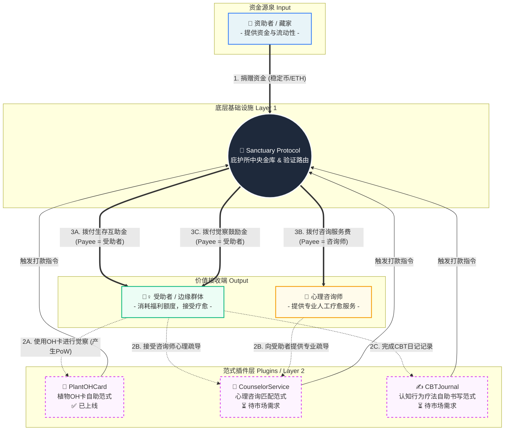
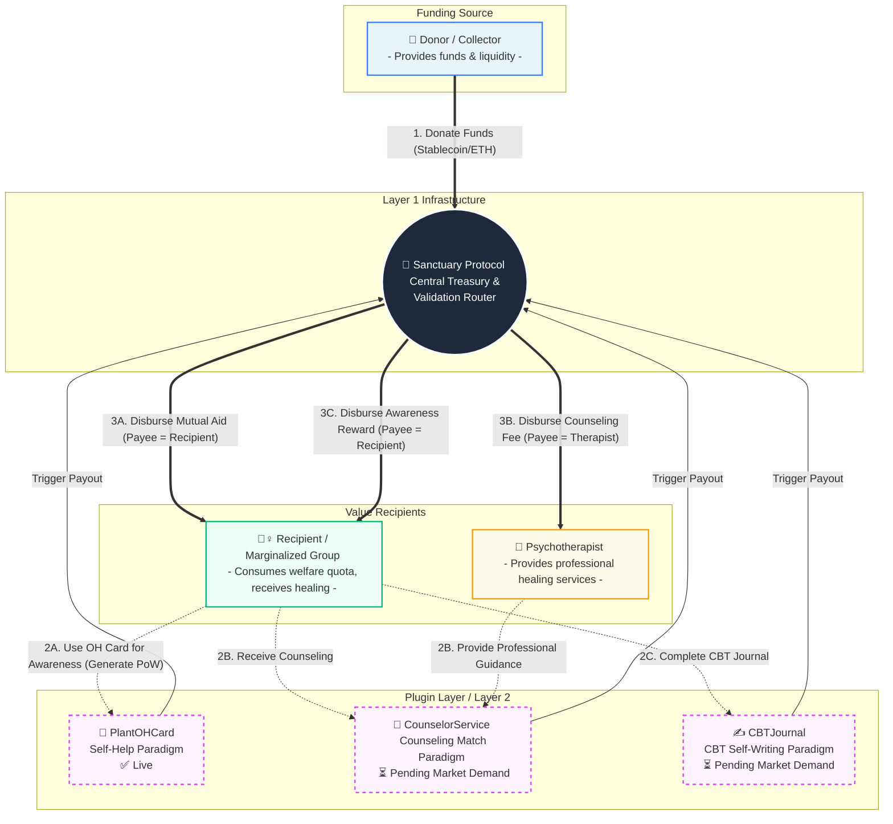

# 🌿 Web3 疗愈庇护所 | Web3 Healing Sanctuary

> **Sanctuary** - v2.2 (疗愈工具 Healing Tool + 互助协议 Mutual Aid Protocol)

**[中文](#-中文)** | **[English](#-english)**

---

## 🇨🇳 中文

**Sanctuary（庇护所）** 是一个去中心化的互助协议平台，为边缘群体提供安全、私密、无审查的心理疗愈庇护空间。平台采用**插件化架构**，支持多种心理疗愈范式（如植物OH卡自助、心理咨询匹配、CBT日记等），通过智能合约实现资金的透明托管与自动拨付，构建可持续的"资助者-受助者"互助生态。

> 🏛️ **核心理念**: 庇护所不仅是疗愈工具，更是一个**去中心化的社会支持基础设施**——让每个人都能在需要时获得庇护，在有能力时成为他人的守护者。

---

### ✨ 核心特性

#### 🌱 疗愈工具

- 🔒 **绝对私密**：前端 AES-256 加密 + IPFS 存储，链上仅存 CID
- 🎴 **4 种经典牌阵**：单张、二元对立、身心灵、乔哈里视窗
- 🌸 **30 张植物图卡**：6 大生命轨迹 × 5 个成长阶段
- 📝 **私密书写**：本地加密 + 前端加密 → IPFS 永久存储
- 🔮 **情绪时光机**：预览未来状态，激励持续疗愈
- 💚 **集体共鸣**：查看有多少人在同一张卡上留下记忆
- 🎨 **疗愈系设计**：低饱和度自然色系，呼吸感 UI

#### 💎 互助协议

- 🤝 **双边经济**：藏家购买卡牌 → 资金进入池子 → 疗愈者完成觉察 → 自动拨付
- 📧 **邮箱验证**：零知识证明模拟（MVP）+ 魔法信封交互
- 🔐 **隐私保护**：无需暴露身份，仅需邮箱验证即可领取资助
- 💰 **无审查资金池**：智能合约自动托管和分发
- 🔍 **完全透明**：所有交易链上可查
- 🔄 **多次领取**：非捐赠者可以多次领取资助（同一邮箱只能领取一次）

---

### 🏗️ 技术架构

| 层级 | 技术选型 |
|------|---------|
| **前端** | Next.js 14 (App Router) + TypeScript 5 + Tailwind CSS 3 |
| **Web3** | wagmi 2 + viem 2 + RainbowKit 2 |
| **加密** | crypto-js (AES-256-GCM) |
| **存储** | Pinata (IPFS) |
| **状态管理** | Zustand 4 |
| **国际化** | next-intl 3 |
| **API** | Next.js API Routes |
| **邮件** | Resend.com |
| **合约** | Solidity 0.8.24 + Hardhat 2.28 + OpenZeppelin 5 |
| **网络** | Avalanche Fuji Testnet (Chain ID: 43113) |

#### 系统架构



> 💡 **插件化设计**: Sanctuary Protocol 采用模块化架构，任何开发者都可以基于 `ISanctuaryPlugin` 接口开发新的疗愈范式插件。当前仅实现了 [🌿 PlantOHCard](https://github.com/Tenlossiby/WWW6.5-Hackathon/tree/main/src/app/%5Blocale%5D/launch) 插件，[💬 CounselorService](https://github.com/Tenlossiby/WWW6.5-Hackathon/tree/main/src/app/%5Blocale%5D/counselor) 和 [✍️ CBTJournal](https://github.com/Tenlossiby/WWW6.5-Hackathon/tree/main/src/app/%5Blocale%5D/cbt) 将根据市场需求后续开发。

#### 合约架构

```
┌─────────────────────────────────────────────────────────────┐
│                    SanctuaryProtocolV2                       │
│              (庇护所中央金库 - UUPS 可升级)                   │
│                                                              │
│  🔌 插件兼容层: 支持任意符合 ISanctuaryPlugin 接口的合约       │
├─────────────────────────────────────────────────────────────┤
│  - 资金池管理 (接收捐赠、拨付资金)                            │
│  - 插件系统 (注册、审计、沙盒期、激活)                        │
│  - 多签治理 (守护者提案、投票、执行)                          │
│  - 防套利机制 (捐赠者不能领取)                               │
│  - 多次领取支持 (非捐赠者可多次领取)                         │
└─────────────────────────────────────────────────────────────┘
                              │
        ┌─────────────────────┼─────────────────────┐
        │                     │                     │
        ▼                     ▼                     ▼
┌───────────────┐    ┌───────────────┐    ┌───────────────┐
│ PlantOHCard   │    │ CounselorSvc  │    │  CBTJournal   │
│   Plugin      │    │   Plugin      │    │   Plugin      │
│   ✅ 已上线    │    │  ⏳ 待开发     │    │  ⏳ 待开发     │
│   (/launch)   │    │  (/counselor) │    │    (/cbt)     │
│               │    │               │    │               │
│ - OH卡疗愈记录 │    │ - 咨询匹配    │    │ - CBT日记    │
│ - PoW验证    │    │ - 服务验证    │    │ - 完成验证    │
│ - 自动拨付   │    │ - 自动拨付    │    │ - 自动拨付    │
└───────────────┘    └───────────────┘    └───────────────┘
```

---

### 🚀 快速开始

**前置要求**: Node.js >= 18.0.0 | npm 或 yarn | MetaMask

```bash
# 1. 克隆项目
git clone <repository-url>
cd SanctuaryProtocol

# 2. 安装依赖
npm install

# 3. 配置环境变量
cp .env.example .env.local
# 编辑 .env.local 填入 Pinata JWT 等配置

# 4. 启动开发服务器
npm run dev
```

访问 [http://localhost:3000](http://localhost:3000)

---

### 📂 项目结构

```
SanctuaryProtocol/
├── contracts/                    # 智能合约
│   ├── SanctuaryProtocolV2.sol   # 资金池托管合约 (UUPS)
│   ├── plugins/
│   │   └── PlantOHCardPlugin.sol # 疗愈插件
│   └── interfaces/               # 接口定义
├── scripts/                      # 部署脚本
├── src/
│   ├── app/[locale]/             # Next.js 页面 (国际化)
│   │   ├── spreads/              # 牌阵选择
│   │   ├── select/               # 卡牌选择
│   │   ├── journal/              # 日记书写
│   │   ├── sanctuary/            # 我的庇护所
│   │   ├── claim/                # 资助申请
│   │   └── guardian/             # 守护者模式
│   ├── components/               # React 组件
│   ├── lib/
│   │   ├── web3/                 # Web3 交互
│   │   ├── encryption.ts         # AES 加密
│   │   └── ipfs.ts               # IPFS 存储 (Pinata)
│   └── stores/                   # Zustand 状态管理
├── Documents/                    # 项目文档
└── hardhat.config.ts             # Hardhat 配置
```

---

### 🧪 测试指南

#### 测试环境

| 项目 | 值 |
|------|-----|
| **网络** | Avalanche Fuji Testnet |
| **Chain ID** | 43113 |
| **区块链浏览器** | https://testnet.snowtrace.io/ |

#### 已部署合约

| 合约 | 地址 |
|------|------|
| **SanctuaryProtocolV2** | `0xc7df8398F5b6571883Fe75Be3B48CEE355b0dA28` |
| **PlantOHCardPlugin** | `0xb2bD4E12aa38a9CbA65822bE3B35f49f30d5162B` |

#### 测试步骤

1. **获取测试 AVAX** — 访问 https://faucet.quicknode.com/avalanche/fuji
2. **连接钱包** — 使用未捐赠过的地址
3. **选择牌阵** → 选卡 → 写日记（至少 10 字符）→ 点击"封存上链"
4. **领取资助** — 完成疗愈后进入领取页面，邮箱验证后领取

#### 领取金额计算

```
基础金额: 0.01 AVAX
+ 卡牌加成: (卡牌数 - 1) × 0.001 AVAX (最多 3 张)
+ 时长加成: (时长 / 10分钟) × 0.001 AVAX (最多 30 分钟)
+ 日记加成: (字数 / 200) × 0.001 AVAX (最多 1000 字)
```

#### 常见问题

**交易失败？** 可能原因：日记太短 / 没有选卡 / 捐赠者不能领取 / 邮箱已使用 / Gas 不足

**查看交易？** 复制 txHash → https://testnet.snowtrace.io/ 搜索

---

### 🎯 用户流程

**疗愈者模式**: 选择牌阵 → 随机选卡 → 私密书写 → 加密存储 → 查看记忆

**守护者模式**: 浏览画廊 → 捐赠收藏 → 透明查看资金池

**资助申请**: 完成觉察 → 邮箱验证 → 自动拨付 → 可多次领取

---

### 🔐 安全性与隐私

```
用户输入 → 前端 AES 加密 → IPFS 存储 → 链上存 CID
```

- ✅ 前端 AES-256-GCM 加密，仅 CID 上链
- ✅ 钱包签名派生密钥，仅持卡人可解密
- ✅ 无管理员密钥，平台方无法查看内容
- ✅ OpenZeppelin 标准库 + ReentrancyGuard 防重入
- ✅ UUPS 可升级 + Pausable 紧急暂停 + 多签治理

---

### 💻 开发命令

```bash
# 前端
npm run dev          # 开发服务器
npm run build        # 构建生产版本
npm run type-check   # 类型检查

# 合约
npx hardhat compile  # 编译合约
npx hardhat test     # 测试合约
npx hardhat run scripts/deploy.ts --network avalancheFuji  # 部署
```

---

### 🔧 环境变量

```bash
# .env.local (必需)
NEXT_PUBLIC_PINATA_JWT=your_jwt_token_here
NEXT_PUBLIC_SANCTUARY_V2_ADDRESS_FUJI=0xc7df8398F5b6571883Fe75Be3B48CEE355b0dA28
NEXT_PUBLIC_PLUGIN_ADDRESS_FUJI=0xb2bD4E12aa38a9CbA65822bE3B35f49f30d5162B

# .env (部署用，不提交 Git)
PRIVATE_KEY=your_private_key_here
```

---

### 🤝 贡献指南

1. Fork 本项目
2. 创建特性分支 (`git checkout -b feature/AmazingFeature`)
3. 提交更改 → 推送 → 提交 Pull Request

---

### 📄 License

MIT License

---

### 🙏 致谢

- **OH 卡**: 源自德国心理学家 Moritz Egetmeyer 的心理投射卡灵感延展
- **Web3 基础设施**: Ethereum, Avalanche, IPFS, Pinata
- **开源社区**: Hardhat, OpenZeppelin, RainbowKit, Wagmi, Viem

---
---

## 🇬🇧 English

**Sanctuary** is a decentralized mutual aid protocol platform that provides a safe, private, and censorship-free sanctuary space for psychological healing to marginalized communities. The platform adopts a **plugin-based architecture** supporting multiple healing paradigms (such as Plant OH Card self-help, counseling matching, CBT journaling, etc.), enabling transparent fund custody and automatic disbursement through smart contracts, building a sustainable "donor-recipient" mutual aid ecosystem.

> 🏛️ **Core Philosophy**: Sanctuary is not just a healing tool, but a **decentralized social support infrastructure** — where everyone can find shelter when in need, and become a guardian for others when able.

---

### ✨ Core Features

#### 🌱 Healing Tool

- 🔒 **Absolute Privacy**: Frontend AES-256 encryption + IPFS storage, only CID stored on-chain
- 🎴 **4 Classic Spreads**: Single Card, Binary Opposition, Body-Mind-Spirit, Johari Window
- 🌸 **30 Plant Image Cards**: 6 life trajectories × 5 growth stages
- 📝 **Private Journaling**: Local encryption → Frontend encryption → IPFS permanent storage
- 🔮 **Emotion Time Machine**: Preview future states, motivate continued healing
- 💚 **Collective Resonance**: See how many others left memories on the same card
- 🎨 **Healing Design**: Low-saturation natural color palette, breathing-space UI

#### 💎 Mutual Aid Protocol

- 🤝 **Two-sided Economy**: Collectors purchase cards → Funds enter pool → Healers complete awareness → Auto-payout
- 📧 **Email Verification**: Zero-knowledge proof simulation (MVP) + Magic Envelope interaction
- 🔐 **Privacy Protection**: No identity exposure required, only email verification needed to claim support
- 💰 **Censorship-free Fund Pool**: Smart contract automated escrow and distribution
- 🔍 **Full Transparency**: All transactions verifiable on-chain
- 🔄 **Multiple Claims**: Non-donors can claim support multiple times (one claim per email)

---

### 🏗️ Tech Architecture

| Layer | Tech Stack |
|-------|-----------|
| **Frontend** | Next.js 14 (App Router) + TypeScript 5 + Tailwind CSS 3 |
| **Web3** | wagmi 2 + viem 2 + RainbowKit 2 |
| **Encryption** | crypto-js (AES-256-GCM) |
| **Storage** | Pinata (IPFS) |
| **State Mgmt** | Zustand 4 |
| **i18n** | next-intl 3 |
| **API** | Next.js API Routes |
| **Email** | Resend.com |
| **Contracts** | Solidity 0.8.24 + Hardhat 2.28 + OpenZeppelin 5 |
| **Network** | Avalanche Fuji Testnet (Chain ID: 43113) |

#### System Architecture



> 💡 **Plugin Architecture**: Sanctuary Protocol uses a modular design where any developer can create new healing paradigm plugins by implementing the `ISanctuaryPlugin` interface. Currently only [🌿 PlantOHCard](https://github.com/Tenlossiby/WWW6.5-Hackathon/tree/main/src/app/%5Blocale%5D/launch) is live, while [💬 CounselorService](https://github.com/Tenlossiby/WWW6.5-Hackathon/tree/main/src/app/%5Blocale%5D/counselor) and [✍️ CBTJournal](https://github.com/Tenlossiby/WWW6.5-Hackathon/tree/main/src/app/%5Blocale%5D/cbt) will be developed based on market demand.

#### Contract Architecture

```
┌─────────────────────────────────────────────────────────────┐
│                    SanctuaryProtocolV2                       │
│              (Sanctuary Central Treasury - UUPS)             │
│                                                              │
│  🔌 Plugin Compatibility: Supports any contract implementing │
│                           ISanctuaryPlugin interface         │
├─────────────────────────────────────────────────────────────┤
│  - Fund Pool Management (receive donations, disburse funds)  │
│  - Plugin System (register, audit, sandbox, activate)        │
│  - Multi-sig Governance (guardian proposals, voting, exec)   │
│  - Anti-arbitrage Mechanism (donors cannot claim)            │
│  - Multiple Claims Support (non-donors can claim repeatedly) │
└─────────────────────────────────────────────────────────────┘
                              │
        ┌─────────────────────┼─────────────────────┐
        │                     │                     │
        ▼                     ▼                     ▼
┌───────────────┐    ┌───────────────┐    ┌───────────────┐
│ PlantOHCard   │    │ CounselorSvc  │    │  CBTJournal   │
│   Plugin      │    │   Plugin      │    │   Plugin      │
│   ✅ Live      │    │  ⏳ Pending    │    │  ⏳ Pending    │
│   (/launch)   │    │  (/counselor) │    │    (/cbt)     │
│               │    │               │    │               │
│ - OH Records │    │ - Matching    │    │ - CBT Journal │
│ - PoW Verify │    │ - Verification│    │ - Completion  │
│ - Auto Payout│    │ - Auto Payout │    │ - Auto Payout │
└───────────────┘    └───────────────┘    └───────────────┘
```

---

### 🚀 Quick Start

**Prerequisites**: Node.js >= 18.0.0 | npm or yarn | MetaMask

```bash
# 1. Clone the repository
git clone <repository-url>
cd SanctuaryProtocol

# 2. Install dependencies
npm install

# 3. Configure environment
cp .env.example .env.local
# Edit .env.local to add your Pinata JWT and other config

# 4. Start development server
npm run dev
```

Visit [http://localhost:3000](http://localhost:3000)

---

### 📂 Project Structure

```
SanctuaryProtocol/
├── contracts/                    # Smart Contracts
│   ├── SanctuaryProtocolV2.sol   # Fund Pool Escrow (UUPS)
│   ├── plugins/
│   │   └── PlantOHCardPlugin.sol # Healing Plugin
│   └── interfaces/               # Interface Definitions
├── scripts/                      # Deployment Scripts
├── src/
│   ├── app/[locale]/             # Next.js Pages (i18n)
│   │   ├── spreads/              # Spread Selection
│   │   ├── select/               # Card Selection
│   │   ├── journal/              # Journal Writing
│   │   ├── sanctuary/            # My Sanctuary
│   │   ├── claim/                # Claim Support
│   │   └── guardian/             # Guardian Mode
│   ├── components/               # React Components
│   ├── lib/
│   │   ├── web3/                 # Web3 Interactions
│   │   ├── encryption.ts         # AES Encryption
│   │   └── ipfs.ts               # IPFS Storage (Pinata)
│   └── stores/                   # Zustand State Management
├── Documents/                    # Project Documentation
└── hardhat.config.ts             # Hardhat Configuration
```

---

### 🧪 Testing Guide

#### Test Environment

| Item | Value |
|------|-------|
| **Network** | Avalanche Fuji Testnet |
| **Chain ID** | 43113 |
| **Block Explorer** | https://testnet.snowtrace.io/ |

#### Deployed Contracts

| Contract | Address |
|----------|---------|
| **SanctuaryProtocolV2** | `0xc7df8398F5b6571883Fe75Be3B48CEE355b0dA28` |
| **PlantOHCardPlugin** | `0xb2bD4E12aa38a9CbA65822bE3B35f49f30d5162B` |

#### Test Steps

1. **Get Test AVAX** — Visit https://faucet.quicknode.com/avalanche/fuji
2. **Connect Wallet** — Use an address that has never donated
3. **Select Spread** → Pick Cards → Write Journal (min 10 chars) → Click "Seal & Upload"
4. **Claim Support** — After healing, go to claim page, verify email, and claim

#### Payout Calculation

```
Base Amount: 0.01 AVAX
+ Card Bonus: (card_count - 1) × 0.001 AVAX (max 3 cards)
+ Duration Bonus: (duration / 10min) × 0.001 AVAX (max 30 min)
+ Journal Bonus: (word_count / 200) × 0.001 AVAX (max 1000 words)
```

#### FAQ

**Transaction failed?** Possible reasons: Journal too short / No card selected / Donor restriction / Email already used / Insufficient gas

**View transaction?** Copy txHash → https://testnet.snowtrace.io/ and search

---

### 🎯 User Flows

**Healer Mode**: Select Spread → Random Card Draw → Private Journaling → Encrypted Storage → View Memories

**Guardian Mode**: Browse Gallery → Donate & Collect → Transparent Pool View

**Support Application**: Complete Awareness → Email Verification → Auto-disbursement → Multiple Claims

---

### 🔐 Security & Privacy

```
User Input → Frontend AES Encryption → IPFS Storage → On-chain CID
```

- ✅ Frontend AES-256-GCM encryption, only CID stored on-chain
- ✅ Wallet signature derived key, only cardholder can decrypt
- ✅ No admin key, platform cannot view content
- ✅ OpenZeppelin standard libs + ReentrancyGuard protection
- ✅ UUPS upgradeable + Pausable emergency stop + Multi-sig governance

---

### 💻 Development Commands

```bash
# Frontend
npm run dev          # Development server
npm run build        # Production build
npm run type-check   # Type checking

# Contracts
npx hardhat compile  # Compile contracts
npx hardhat test     # Test contracts
npx hardhat run scripts/deploy.ts --network avalancheFuji  # Deploy
```

---

### 🔧 Environment Variables

```bash
# .env.local (required)
NEXT_PUBLIC_PINATA_JWT=your_jwt_token_here
NEXT_PUBLIC_SANCTUARY_V2_ADDRESS_FUJI=0xc7df8398F5b6571883Fe75Be3B48CEE355b0dA28
NEXT_PUBLIC_PLUGIN_ADDRESS_FUJI=0xb2bD4E12aa38a9CbA65822bE3B35f49f30d5162B

# .env (for deployment, do NOT commit to Git)
PRIVATE_KEY=your_private_key_here
```

---

### 🤝 Contributing

1. Fork this project
2. Create a feature branch (`git checkout -b feature/AmazingFeature`)
3. Commit changes → Push → Submit Pull Request

---

### 📄 License

MIT License

---

### 🙏 Acknowledgements

- **OH Cards**: Inspired by German psychologist Moritz Egetmeyer's psychological projection cards
- **Web3 Infrastructure**: Ethereum, Avalanche, IPFS, Pinata
- **Open Source Community**: Hardhat, OpenZeppelin, RainbowKit, Wagmi, Viem

---

<div align="center">

**🌿 在 Web3 的世界里，种下属于你的疗愈之树 🌿**
**🌿 Plant your own healing tree in the Web3 world 🌿**

Made with ❤️ by the Web3 PlantThemed OH Card Team

</div>
