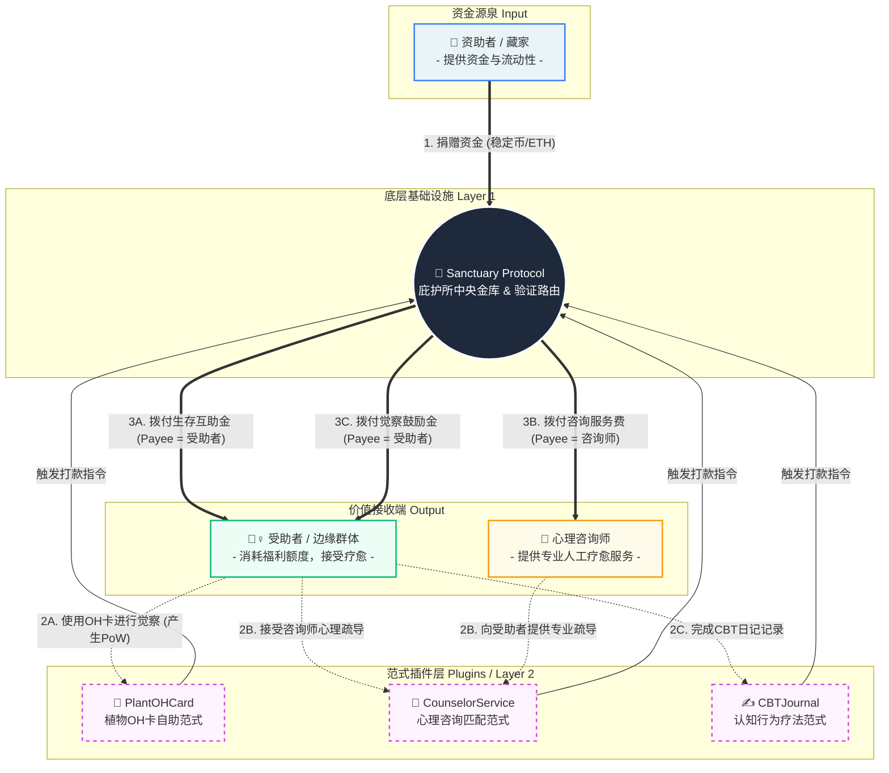

# 产品需求文档 (PRD)：庇护所协议 (Sanctuary Protocol) 平台化生态架构

---

## 📝 文档版本记录

| 版本 | 日期 | 更新内容 | 作者 |
|------|------|----------|------|
| v2.2 | 2026-03-27 | **平台化生态架构升级**：引入插件化范式层、资金与服务分离架构、开放SDK设计 | Web3 植物系OH卡项目组 |
| v2.1 | 2026-03-24 | 完善ZK-Email模拟方案详细设计、修复24小时时间限制合约逻辑、补充完整防套利机制 | Web3 植物系OH卡项目组 |
| v2.0 | 2024-03-23 | 协议化升级：双边经济资金分配插件 | Web3 植物系OH卡项目组 |
| v1.1 | 2024-03-22 | IPFS集成方案、优化解密体验、时间机器权限 | Web3 植物系OH卡项目组 |
| v1.0 | 2024-03-20 | 初始版本 | Web3 植物系OH卡项目组 |

---

## 1. 引言 / 概述 (Introduction / Overview)

### 1.1 核心哲学

> **资金与服务分离。底层金库无条件护航，上层范式百花齐放。资助者与受助者永不相见，但善意通过代码精准流转。**

Sanctuary Protocol v2.2 是一次**架构范式的跃迁**——从单一应用升级为**可组合的平台生态**。我们将资金托管与疗愈服务彻底解耦，让庇护所成为滋养无数疗愈创新的基础设施。

### 1.2 架构演进对比

| 维度 | v2.1 及之前 | v2.2 平台化架构 |
|------|-------------|-----------------|
| **核心定位** | 双边资金分配插件 | 疗愈生态基础设施 |
| **资金流向** | 直接：资助者 → 受助者 | 间接：资助者 → 金库 → 插件 → 受助者/服务者 |
| **服务形态** | 单一OH卡自助 | 多范式插件（自助+人工+混合） |
| **扩展性** | 需修改核心合约 | 插件即插即用，无需改动金库 |
| **角色边界** | 资助者/受助者二元 | 资助者/受助者/资源提供者三元 |

### 1.3 最小闭环（MVP v2.2）

```
资助者购买OH卡 → 资金进入庇护所金库 → 受助者完成OH卡觉察 → 
PlantOHCard插件触发指令 → 庇护所拨付生存互助金 → 受助者接收资金
```

### 1.4 免责声明

> ⚠️ **重要声明**：本项目仅用于黑客松场景与逻辑架构层面的技术探索。不构成任何形式的投资建议、医疗建议或法律建议。所有资金流转均在测试网环境进行，不涉及真实资产。

---

### 1.5 实施路径建议

> **重要提示**：v2.2是架构愿景，建议分阶段实施以降低风险。从v1的"加密OH卡日记"到v2.2的"插件平台+多签治理+托管仲裁+动态资金调整"，功能跨度极大，存在**范围膨胀风险**。

#### 阶段1：v2.1闭环（P0 - 1-2周）
**目标**：让捐赠→验证→申领流程端到端跑通

**必须完成**：
- [ ] 部署v2.1合约到测试网
- [ ] 完成OH卡选卡→日记→加密→IPFS→上链完整流程
- [ ] 完成邮箱验证→领取资金闭环
- [ ] 基础资金池功能可用

**成功标准**：一个真实用户可以完成从选卡到领取的完整流程

#### 阶段2：v2.2基础（P1 - 2-3周）
**目标**：建立插件化基础，但不追求完整功能

**必须完成**：
- [ ] 重构合约为UUPS可升级模式
- [ ] 创建ISanctuaryPlugin接口
- [ ] 创建PlantOHCardPlugin（唯一插件）
- [ ] 前端适配插件调用

**刻意不做**：
- [ ] 多签治理（保留onlyOwner）
- [ ] 资金托管系统（CounselorService仅做占位页）
- [ ] 动态资金调整

#### 阶段3：v2.2完整（P2 - 4-6周）
**目标**：实现PRD中的完整架构

**包括**：
- [ ] 多签治理（3/5多签）
- [ ] 资金托管系统（人力范式）
- [ ] 动态资金调整
- [ ] 第二个插件（CBTJournal或CounselorService完整版）

#### 决策点

在完成阶段1后，评估以下指标决定是否继续阶段2：
1. **用户反馈**：v2.1是否有真实用户使用？
2. **资金池健康度**：是否有持续捐赠流入？
3. **技术债务**：v2.1代码是否稳定？

如果以上3个指标都不理想，建议暂停v2.2，先优化v2.1。

---

### 1.6 ZK-Email安全假设与风险提示

#### 当前实现的安全假设（MVP阶段）

| 方案 | 当前代码实现 | 安全假设 |
|------|-------------|----------|
| **邮箱验证** | 后端验证码 + 白名单 | 信任后端服务器不存储邮箱 |
| **验证有效期** | 24小时 | 时间窗口内完成验证 |
| **防重放** | emailHashUsed映射 | 链上记录防止重复领取 |

#### 与真实ZK-Email的安全差异

| 维度 | MVP方案（当前） | 真实ZK-Email |
|------|----------------|--------------|
| **信任模型** | 需要信任后端服务器 | 零信任，纯密码学证明 |
| **隐私保护** | 后端知道邮箱地址 | 合约只知道"验证通过"，不知道邮箱 |
| **抗审查性** | 后端可以拒绝服务 | 无法审查，本地生成证明 |
| **开发复杂度** | 2-3天 | 2-4周 |

#### 明确标注

在代码中，所有与ZK-Email相关的函数和组件都应明确标注当前实现方式：

```typescript
// src/lib/zkEmailSimulation.ts
/**
 * ⚠️ MVP阶段实现说明：
 * - 当前：后端验证码模拟方案
 * - 未来：替换为真实ZK-Email SDK
 * - 前端体验保持一致，后端验证逻辑不同
 */
export async function simulateZKProof(...) {...}
```

```solidity
// contracts/SanctuaryProtocol.sol
/**
 * @notice 验证邮箱（MVP阶段：后端调用）
 * @dev ⚠️ 安全假设：信任后端服务器
 * @dev 未来版本：此函数将被替换为ZK-Email验证器合约地址检查
 */
function verifyEmail(bytes32 emailHash, address wallet) external onlyOwner {...}
```

#### 升级路径

```
MVP: 后端验证码 → 过渡: 可选ZK-Email → 完整: 强制ZK-Email
```

---

## 2. 核心角色与绝对边界 (Role Boundaries)

### 💎 资助者 (Donor / 守护者)

**动作**：向底层协议（庇护所）注入资金（买卡/直接捐赠）。

**边界**：**单向盲捐**。绝对无法追踪具体受助者的身份，不可干预资金具体流向，不能指定或推荐具体的咨询师。

**价值获得**：
- 数字艺术收藏（植物OH卡NFT）
- 链上善举凭证（不可篡改的捐赠记录）
- 资金池透明度（实时查看帮助人数与资金流向类型）

---

### 🌿 受助者 (Recipient / 疗愈者)

**动作**：连接各个"范式插件"（如抽卡、书写、接受咨询），完成觉察工作量证明（PoW）。

**边界**：在涉及第三方人工服务（如咨询师）时，**绝对不触碰资金**。费用由协议代付，捍卫受助者的尊严（消除"掏钱/被施舍"的心理压力）。

**尊严保障**：
- 全程无需暴露真实身份
- 人工服务场景中"零付费感知"
- 觉察记录完全私密（本地加密+IPFS）

---

### 🤝 资源提供者 (Resource Provider)

**类型**：心理咨询师、艺术创作者、社工服务者。

**动作**：在"人力范式插件"中为受助者提供服务（或捐赠作品版权）。

**边界**：从"庇护所金库"领取酬劳，不向受助者直接索要费用，也不向资助者负责。

**结算方式**：
- 按服务次数结算（如：完成1小时咨询）
- 按作品使用次数结算（如：某张艺术卡被使用次数）
- 定期批量结算（减少Gas成本）

---

## 3. 资金流向与服务交互双螺旋 (Flow Analysis)

整个生态的运行，由**资金流（金钱转移）**和**交互流（服务/行为过程）**构成双螺旋闭环。

### 场景 A：自助型客体范式（如：OH卡应用、CBT书写）

```
交互流：受助者 ↔ OH卡子合约 （前端完成心理觉察）
         ↓
指令流：OH卡子合约 ➔ 告诉庇护所主合约："觉察已完成"
         ↓
资金流：庇护所主合约 ➔ 直接打放一笔【生存互助金】给受助者钱包
```

**典型插件**：
- 🌿 PlantOHCard：植物OH卡自助觉察
- ✍️ CBTJournal：认知行为疗法日记
- 🎨 ArtTherapy：房树人绘画疗愈

---

### 场景 B：人力资源型范式（如：心理咨询服务）

```
交互流：受助者 ↔ 咨询师（通过咨询服务子合约匹配并完成1小时疗愈）
         ↓
指令流：咨询服务子合约 ➔ 告诉庇护所主合约："咨询已交付"
         ↓
资金流：庇护所主合约 ➔ 发放【咨询服务费】给心理咨询师钱包
         （受助者全程不碰钱）
```

**典型插件**：
- 💬 CounselorService：心理咨询匹配
- 👥 GroupTherapy：团体疗愈小组
- 📚 WorkshopHub：疗愈工作坊

---

### 场景 C：混合型范式（如：OH卡+咨询组合包）

```
交互流：受助者完成OH卡觉察 → 系统推荐匹配咨询师 → 完成深度咨询
         ↓
指令流：组合插件分别触发两次打款指令
         ↓
资金流1：庇护所 ➔ 受助者（觉察鼓励金）
资金流2：庇护所 ➔ 咨询师（咨询服务费）
```

---

## 4. 可视化生态架构图 (Mermaid Flowchart)



---

## 5. 技术架构详解 (Technical Architecture)

### 5.1 三层架构模型

```
┌─────────────────────────────────────────────────────────────┐
│                    Layer 3: 前端应用层                        │
│  ┌─────────────┐ ┌─────────────┐ ┌─────────────┐            │
│  │  OH卡界面    │ │ 咨询预约界面 │ │ 日记书写界面 │            │
│  └─────────────┘ └─────────────┘ └─────────────┘            │
└─────────────────────────────────────────────────────────────┘
                              │
                              ▼
┌─────────────────────────────────────────────────────────────┐
│                    Layer 2: 范式插件层                        │
│  ┌─────────────┐ ┌─────────────┐ ┌─────────────┐            │
│  │PlantOHCard  │ │ Counselor   │ │ CBTJournal  │            │
│  │  子合约     │ │  子合约      │ │  子合约      │            │
│  └─────────────┘ └─────────────┘ └─────────────┘            │
│  职责：验证PoW、触发指令、记录行为数据                           │
└─────────────────────────────────────────────────────────────┘
                              │
                              ▼
┌─────────────────────────────────────────────────────────────┐
│                    Layer 1: 庇护所协议层                      │
│  ┌─────────────────────────────────────────────────────┐    │
│  │              SanctuaryProtocol.sol                   │    │
│  │  ┌─────────────┐ ┌─────────────┐ ┌─────────────┐    │    │
│  │  │  资金托管    │ │  插件注册表  │ │  指令路由    │    │    │
│  │  └─────────────┘ └─────────────┘ └─────────────┘    │    │
│  └─────────────────────────────────────────────────────┘    │
│  职责：资金安全、插件准入、资金拨付、事件记录                     │
└─────────────────────────────────────────────────────────────┘
```

### 5.2 核心合约改造 (SanctuaryProtocol.sol)

#### 新增数据结构

```solidity
/// @dev 合法插件信息
struct PluginInfo {
    address pluginAddress;      // 插件合约地址
    string pluginType;          // 插件类型："self-help" | "human-service" | "hybrid"
    string pluginName;          // 插件名称
    bool isActive;              // 是否激活
    uint256 registeredAt;       // 注册时间
    uint256 totalPayouts;       // 总拨付次数
    uint256 totalAmount;        // 总拨付金额
}

/// @dev 插件支付请求
struct PayoutRequest {
    address user;               // 受助者地址
    address payee;              // 实际收款人（可能是用户本人或服务者）
    uint256 amount;             // 金额
    string payoutType;          // 支付类型："survival-aid" | "counseling-fee" | "encouragement"
    bytes32 proofHash;          // 工作量证明哈希
    uint256 requestedAt;        // 请求时间
}

// 合法插件注册表
mapping(address => PluginInfo) public approvedPlugins;
address[] public pluginList;

// 支付请求记录
PayoutRequest[] public payoutHistory;

// 每个用户的福利额度（防止滥用）
mapping(address => uint256) public userWelfareQuota;
mapping(address => uint256) public userWelfareUsed;
```

#### 核心函数改造

```solidity
/**
 * @notice 注册新插件（仅Owner）
 * @param plugin 插件合约地址
 * @param pluginType 插件类型
 * @param pluginName 插件名称
 */
function registerPlugin(
    address plugin, 
    string calldata pluginType, 
    string calldata pluginName
) external onlyOwner {
    require(!approvedPlugins[plugin].isActive, "Plugin already registered");
    
    approvedPlugins[plugin] = PluginInfo({
        pluginAddress: plugin,
        pluginType: pluginType,
        pluginName: pluginName,
        isActive: true,
        registeredAt: block.timestamp,
        totalPayouts: 0,
        totalAmount: 0
    });
    
    pluginList.push(plugin);
    emit PluginRegistered(plugin, pluginType, pluginName);
}

/**
 * @notice 插件请求资金拨付（仅合法插件可调用）
 * @param user 受助者地址
 * @param payee 实际收款地址
 * @param amount 金额
 * @param payoutType 支付类型
 * @param proofHash 工作量证明哈希
 */
function pluginRequestPayout(
    address user,
    address payee,
    uint256 amount,
    string calldata payoutType,
    bytes32 proofHash
) external nonReentrant whenNotPaused {
    // 验证调用者是合法插件
    require(approvedPlugins[msg.sender].isActive, "Not an approved plugin");
    
    // 验证受助者不是资助者
    require(totalDonated[user] == 0, "Donors cannot receive aid");
    
    // 验证福利额度
    require(userWelfareUsed[user] + amount <= userWelfareQuota[user], "Exceeds welfare quota");
    
    // 验证资金池余额
    require(poolBalance >= amount, "Insufficient pool balance");
    
    // 更新状态
    userWelfareUsed[user] += amount;
    poolBalance -= amount;
    
    // 更新插件统计
    approvedPlugins[msg.sender].totalPayouts++;
    approvedPlugins[msg.sender].totalAmount += amount;
    
    // 记录支付
    payoutHistory.push(PayoutRequest({
        user: user,
        payee: payee,
        amount: amount,
        payoutType: payoutType,
        proofHash: proofHash,
        requestedAt: block.timestamp
    }));
    
    // 转账
    (bool success, ) = payable(payee).call{value: amount}("");
    require(success, "Transfer failed");
    
    emit PluginPayout(msg.sender, user, payee, amount, payoutType);
}

/**
 * @notice 设置用户福利额度（仅Owner）
 * @param user 用户地址
 * @param quota 额度
 */
function setUserWelfareQuota(address user, uint256 quota) external onlyOwner {
    userWelfareQuota[user] = quota;
    emit WelfareQuotaSet(user, quota);
}
```

### 5.3 插件合约标准接口 (ISanctuaryPlugin.sol)

```solidity
// SPDX-License-Identifier: MIT
pragma solidity ^0.8.20;

/**
 * @title ISanctuaryPlugin
 * @dev 庇护所范式插件标准接口
 */
interface ISanctuaryPlugin {
    
    /// @notice 插件类型枚举
    enum PluginType { SELF_HELP, HUMAN_SERVICE, HYBRID }
    
    /// @notice 获取插件信息
    function getPluginInfo() external view returns (
        string memory name,
        string memory version,
        PluginType pluginType,
        string memory description
    );
    
    /// @notice 验证用户是否完成工作量证明
    function verifyProofOfWork(address user, bytes calldata proofData) external view returns (bool);
    
    /// @notice 记录用户行为（由前端调用）
    function recordActivity(
        address user, 
        string calldata activityType, 
        bytes32 proofHash
    ) external;
    
    /// @notice 触发资金拨付请求
    function requestPayout(
        address user,
        address payee,
        uint256 amount,
        string calldata payoutType,
        bytes32 proofHash
    ) external;
    
    /// @notice 获取用户在当前插件的统计数据
    function getUserStats(address user) external view returns (
        uint256 activityCount,
        uint256 lastActivityTime,
        bool isEligibleForAid
    );
    
    /// @notice 插件激活状态
    function isActive() external view returns (bool);
    
    // --- 事件 ---
    
    event ActivityRecorded(
        address indexed user,
        string activityType,
        bytes32 proofHash,
        uint256 timestamp
    );
    
    event PayoutRequested(
        address indexed user,
        address indexed payee,
        uint256 amount,
        string payoutType
    );
}
```

### 5.5 Gas成本优化策略（新增）

> **问题**：单笔交易约$4 Gas费（100k gas × 20 gwei），对于互助申领场景（申领金额0.01-0.02 ETH），Gas占比可能超过50%。Relay Network在PRD中提及但无实现方案。

#### 当前成本分析（Avalanche Fuji测试网）

| 操作 | 预估Gas | 成本(20 gwei) | 成本($4/AVAX) |
|------|---------|---------------|---------------|
| 捐赠(donateAndMint) | ~80,000 | 0.0016 AVAX | $0.0064 |
| 领取(claim) | ~120,000 | 0.0024 AVAX | $0.0096 |
| 插件拨付(pluginRequestPayout) | ~150,000 | 0.003 AVAX | $0.012 |

**问题**：申领金额0.01 ETH (~$40)，Gas成本$0.01，占比25%。

#### 优化策略

##### 策略1：交易合并（已实现）
```solidity
// 将记录和拨付合并为一次交易
function recordAndRequestPayout(
    address user,
    bytes32 proofHash,
    uint256[] calldata cardIds,
    uint256 duration,
    uint256 journalLength
) external {
    // 1. 记录活动
    _recordActivity(user, cardIds, duration, journalLength);
    
    // 2. 验证PoW
    require(_verifyProofOfWork(user), "Invalid proof");
    
    // 3. 直接拨付（省去二次调用）
    uint256 amount = sanctuary.getDynamicClaimAmount();
    sanctuary.pluginRequestPayout(user, user, amount, "survival-aid", proofHash);
}
```

##### 策略2：Gas代付（Relay Network）
```typescript
// src/lib/web3/gasless.ts
import { GelatoRelay } from '@gelatonetwork/relay-sdk';

const relay = new GelatoRelay();

export async function claimWithGasless(
  emailHash: string,
  signature: string
) {
  // 受助者无需支付Gas
  const tx = await relay.sponsoredCall(
    {
      chainId: 43113, // Avalanche Fuji
      target: SANCTUARY_ADDRESS,
      data: encodeClaimData(emailHash, signature),
    },
    process.env.NEXT_PUBLIC_GELATO_API_KEY!
  );
  return tx;
}
```

**实施条件**：
- [ ] 注册Gelato账号：https://app.gelato.network/
- [ ] 充值Gas费（USDC/ETH）
- [ ] 配置API Key

##### 策略3：批量处理
```solidity
// 批量拨付，均摊Gas成本
function batchPayout(
    address[] calldata users,
    uint256[] calldata amounts,
    bytes32[] calldata proofHashes
) external onlyOwner {
    require(users.length <= 50, "Batch too large");
    
    for(uint i = 0; i < users.length; i++) {
        _payout(users[i], amounts[i], proofHashes[i]);
    }
    // 50笔交易，总Gas ~500,000，单笔均摊 ~10,000 Gas
}
```

##### 策略4：L2迁移（长期）
考虑迁移到Gas更低的L2：
- Arbitrum Nova: Gas降低90%
- Optimism: Gas降低80%
- Base: Gas降低80%

#### Gas优化实施优先级

| 策略 | 复杂度 | 效果 | 优先级 |
|------|--------|------|--------|
| 交易合并 | 低 | 节省20% | P0 |
| Relay代付 | 中 | 用户零Gas | P1 |
| 批量处理 | 中 | 均摊50% | P1 |
| L2迁移 | 高 | 降低90% | P2 |

---

### 5.6 插件接口设计原则：从实践中提炼

> **警告**：以下接口是基于理论设计的，**在实现第二个插件之前，接口可能会变化**。

#### 推荐实施顺序

```
步骤1: 硬编码PlantOHCard逻辑 → 步骤2: 提炼接口 → 步骤3: 验证接口 → 步骤4: 固化接口
```

#### 步骤1：硬编码实现（Week 1）

先不定义接口，直接在SanctuaryProtocol中硬编码PlantOHCard的支持：

```solidity
// 不定义接口，直接实现
function plantOHCardPayout(
    address user,
    uint256[] calldata cardIds,
    uint256 duration,
    uint256 journalLength
) external {
    // 验证PoW
    require(cardIds.length >= 1, "Need at least 1 card");
    require(duration >= 180, "Need at least 3 minutes");
    require(journalLength >= 50, "Need at least 50 characters");
    
    // 拨付
    _payout(user, 0.01 ether);
}
```

#### 步骤2：提炼接口（Week 2）

在硬编码实现运行正常后，提炼共同模式：

```solidity
// 发现所有插件都需要：
// 1. 验证PoW
// 2. 记录活动
// 3. 请求拨付
interface ISanctuaryPlugin {
    function verifyProofOfWork(address user, bytes calldata proofData) external view returns (bool);
    function recordActivity(address user, ...) external;
    function requestPayout(address user, ...) external;
}
```

#### 步骤3：验证接口（Week 3-4）

用第二个插件（如CBTJournal）验证接口是否通用：

```solidity
contract CBTJournalPlugin is ISanctuaryPlugin {
    // 实现相同接口
    // 如果发现接口不适用，立即修改
}
```

#### 步骤4：固化接口（Week 5+）

当2-3个插件都成功运行后，接口基本稳定，可以固化为标准。

#### 当前PRD接口的状态

| 接口函数 | 置信度 | 说明 |
|----------|--------|------|
| `verifyProofOfWork` | 90% | 所有插件都需要验证 |
| `recordActivity` | 80% | 可能需要调整参数 |
| `requestPayout` | 70% | 可能需要合并到recordActivity |
| `getPluginInfo` | 95% | 元数据是通用的 |
| `recordAndRequestPayout` | 60% | Gas优化函数，可能变化 |

**建议**：在实现时保持接口的可变性，不要过早固化。

---

### 5.4 PlantOHCard 插件合约示例

```solidity
// SPDX-License-Identifier: MIT
pragma solidity ^0.8.20;

import "./ISanctuaryPlugin.sol";
import "./ISanctuaryProtocol.sol";

/**
 * @title PlantOHCardPlugin
 * @dev 植物OH卡自助疗愈插件
 */
contract PlantOHCardPlugin is ISanctuaryPlugin {
    
    ISanctuaryProtocol public sanctuary;
    
    struct HealingSession {
        address user;
        uint256[] cardIds;
        uint256 duration;           // 停留时长（秒）
        uint256 journalLength;      // 日记字数
        bytes32 journalHash;        // 日记内容哈希
        uint256 timestamp;
        bool payoutRequested;
    }
    
    // 用户地址 -> 会话列表
    mapping(address => HealingSession[]) public sessions;
    
    // 最小要求
    uint256 public constant MIN_DURATION = 180;      // 3分钟
    uint256 public constant MIN_JOURNAL_LENGTH = 50; // 50字
    uint256 public constant PAYOUT_AMOUNT = 0.01 ether;
    
    constructor(address _sanctuary) {
        sanctuary = ISanctuaryProtocol(_sanctuary);
    }
    
    function getPluginInfo() external pure override returns (
        string memory name,
        string memory version,
        PluginType pluginType,
        string memory description
    ) {
        return (
            "PlantOHCard",
            "1.0.0",
            PluginType.SELF_HELP,
            "植物OH卡自助疗愈范式，通过图文卡觉察触发生存互助金"
        );
    }
    
    function recordActivity(
        address user,
        string calldata activityType,
        bytes32 proofHash
    ) external override {
        // 解码proofData获取会话详情
        // 实际实现中需要更严谨的编码/解码
        
        // 验证工作量证明
        require(verifyProofOfWork(user, abi.encode(proofHash)), "Invalid proof");
        
        emit ActivityRecorded(user, activityType, proofHash, block.timestamp);
    }
    
    function verifyProofOfWork(address user, bytes calldata proofData) 
        external 
        view 
        override 
        returns (bool) 
    {
        // 检查用户是否有合格会话
        HealingSession[] memory userSessions = sessions[user];
        if (userSessions.length == 0) return false;
        
        HealingSession memory lastSession = userSessions[userSessions.length - 1];
        
        // 验证最低要求
        if (lastSession.duration < MIN_DURATION) return false;
        if (lastSession.journalLength < MIN_JOURNAL_LENGTH) return false;
        if (lastSession.payoutRequested) return false;
        
        return true;
    }
    
    function requestPayout(
        address user,
        address payee,
        uint256 amount,
        string calldata payoutType,
        bytes32 proofHash
    ) external override {
        require(verifyProofOfWork(user, ""), "Proof of work not verified");
        
        // 标记已请求支付
        HealingSession[] storage userSessions = sessions[user];
        userSessions[userSessions.length - 1].payoutRequested = true;
        
        // 向庇护所请求拨付
        sanctuary.pluginRequestPayout(
            user,
            payee,
            amount,
            payoutType,
            proofHash
        );
        
        emit PayoutRequested(user, payee, amount, payoutType);
    }
    
    function getUserStats(address user) external view override returns (
        uint256 activityCount,
        uint256 lastActivityTime,
        bool isEligibleForAid
    ) {
        HealingSession[] memory userSessions = sessions[user];
        activityCount = userSessions.length;
        
        if (activityCount > 0) {
            lastActivityTime = userSessions[activityCount - 1].timestamp;
            isEligibleForAid = verifyProofOfWork(user, "");
        }
    }
    
    function isActive() external pure override returns (bool) {
        return true;
    }
}
```

---

## 6. 前端架构升级 (Frontend Architecture)

### 6.1 插件化前端设计

```typescript
// src/plugins/types.ts

export interface SanctuaryPlugin {
  id: string;
  name: string;
  type: 'self-help' | 'human-service' | 'hybrid';
  icon: string;
  description: string;
  component: React.ComponentType<PluginProps>;
  
  // 插件能力声明
  capabilities: {
    canRecordActivity: boolean;
    canRequestPayout: boolean;
    requiresHumanService: boolean;
  };
  
  // 验证用户是否完成PoW
  verifyProofOfWork: (user: string) => Promise<boolean>;
  
  // 请求资金拨付
  requestPayout: (params: PayoutParams) => Promise<TransactionResult>;
}

export interface PluginProps {
  userAddress: string;
  sanctuaryContract: SanctuaryContract;
  onActivityRecorded: (activity: ActivityRecord) => void;
  onPayoutRequested: (payout: PayoutRecord) => void;
}
```

### 6.2 插件注册中心

```typescript
// src/plugins/registry.ts

import { PlantOHCardPlugin } from './plant-oh-card';
import { CBTJournalPlugin } from './cbt-journal';
import { CounselorServicePlugin } from './counselor-service';

export const pluginRegistry: Record<string, SanctuaryPlugin> = {
  'plant-oh-card': PlantOHCardPlugin,
  'cbt-journal': CBTJournalPlugin,
  'counselor-service': CounselorServicePlugin,
};

export function getActivePlugins(): SanctuaryPlugin[] {
  return Object.values(pluginRegistry).filter(p => p.isActive?.() ?? true);
}

export function getPluginById(id: string): SanctuaryPlugin | undefined {
  return pluginRegistry[id];
}
```

### 6.3 统一资金池状态展示

```typescript
// src/hooks/useSanctuaryPool.ts

export function useSanctuaryPool() {
  const [poolStatus, setPoolStatus] = useState<PoolStatus>({
    balance: '0',
    totalDonations: 0,
    totalPayouts: 0,
    activePlugins: [],
    recentPayouts: [],
  });

  const fetchPoolStatus = useCallback(async () => {
    const [balance, donationCount, claimCount] = await publicClient.readContract({
      address: SANCTUARY_ADDRESS,
      abi: SanctuaryABI,
      functionName: 'getPoolStatus',
    });

    // 获取插件列表
    const plugins = await publicClient.readContract({
      address: SANCTUARY_ADDRESS,
      abi: SanctuaryABI,
      functionName: 'getPluginList',
    });

    // 获取每个插件的统计
    const pluginStats = await Promise.all(
      plugins.map(async (address: string) => {
        const info = await publicClient.readContract({
          address: SANCTUARY_ADDRESS,
          abi: SanctuaryABI,
          functionName: 'approvedPlugins',
          args: [address],
        });
        return {
          address,
          name: info.pluginName,
          type: info.pluginType,
          totalPayouts: info.totalPayouts,
          totalAmount: formatEther(info.totalAmount),
        };
      })
    );

    setPoolStatus({
      balance: formatEther(balance),
      totalDonations: donationCount,
      totalPayouts: claimCount,
      activePlugins: pluginStats,
      recentPayouts: [], // 从事件日志获取
    });
  }, []);

  return { poolStatus, refetch: fetchPoolStatus };
}
```

---

## 7. 技术演进路线 (Roadmap)

### Phase 1: 枢纽重构 (当前任务)

**目标**：完成核心合约的平台化改造

**任务清单**：
- [ ] 重构 `SanctuaryProtocol.sol`，引入 `approvedPlugins` （合法插件注册表）
- [ ] 将原来的发钱函数改造为 `pluginRequestPayout(user, payee, amount, payoutType, proofHash)`
- [ ] 添加用户福利额度管理系统
- [ ] 部署升级后的合约到测试网
- [ ] 更新前端合约交互层

**验收标准**：
- 新合约可以通过 `registerPlugin` 注册插件
- 插件可以通过 `pluginRequestPayout` 请求资金拨付
- 资金池状态正确追踪各插件的拨付统计

---

### Phase 2: 首个范式落地

**目标**：完成【资助者 -> 庇护所 -> OH卡指令 -> 受助者】的最小闭环

**任务清单**：
- [ ] 开发 `PlantOHCardPlugin.sol` 合约
- [ ] 将前端OH卡交互与 `PlantOHCardPlugin` 合约桥接
- [ ] 将 `PlantOHCardPlugin` 注册为 Sanctuary 的第一个合法 Plugin
- [ ] 实现完整的资金流转测试
- [ ] 更新前端UI，展示插件化架构

**验收标准**：
- 用户完成OH卡觉察后，系统自动触发资金拨付
- 资金从庇护所金库流向受助者钱包
- 全程无需用户手动操作资金

---

### Phase 3: 开放生态

**目标**：允许第三方开发者接入庇护所资金池

**任务清单**：
- [ ] 发布 SDK 与 API 规范文档
- [ ] 提供插件开发模板和示例代码
- [ ] 建立插件审核与注册流程
- [ ] 允许第三方开发者、NGO组织或心理诊所编写"疗愈插件"
- [ ] 建立插件质量评估体系

**SDK核心功能**：
```typescript
// @sanctuary-protocol/sdk

import { SanctuarySDK } from '@sanctuary-protocol/sdk';

const sdk = new SanctuarySDK({
  sanctuaryAddress: '0x...',
  provider: window.ethereum,
});

// 注册新插件
await sdk.registerPlugin({
  name: 'MyTherapyApp',
  type: 'self-help',
  contractAddress: '0x...',
});

// 请求资金拨付
await sdk.requestPayout({
  user: userAddress,
  payee: payeeAddress,
  amount: '0.01',
  payoutType: 'survival-aid',
  proofHash: '0x...',
});
```

---

### Phase 4: 人力范式接入

**目标**：接入心理咨询师等人力资源

**任务清单**：
- [ ] 开发 `CounselorServicePlugin.sol` 合约
- [ ] 设计咨询师注册与资质验证机制
- [ ] 实现受助者与咨询师的匹配算法
- [ ] 设计服务完成验证机制（双方确认+超时机制）
- [ ] 实现咨询师酬劳自动结算

**关键设计**：
- 咨询师注册时需质押保证金（防止恶意行为）
- 服务完成后双方确认，触发资金拨付
- 争议解决机制（引入仲裁者角色）

---

## 8. 安全与风控机制

### 8.1 插件准入机制（增强版）

**问题**：仅验证接口不足以保证安全，恶意插件可以实现接口但包含后门。

**解决方案**：引入多阶段审核流程

```solidity
/// @dev 插件审核状态
enum AuditStatus { PENDING, AUDITING, SANDBOX, APPROVED, REJECTED }

/// @dev 插件审核信息
struct PluginAudit {
    address plugin;
    AuditStatus status;
    uint256 submittedAt;
    uint256 auditCompletedAt;
    uint256 sandboxEndTime;
    bytes32 auditReportHash;      // 审计报告IPFS哈希
    address[] auditors;           // 审计机构列表
    bool hasSecurityAudit;        // 是否通过安全审计
    uint256 initialAllowance;     // 初始额度限制
}

mapping(address => PluginAudit) public pluginAudits;

/// @notice 多签治理地址（3/5多签）
address public multisigGovernance;

/// @notice 审计机构白名单
mapping(address => bool) public approvedAuditors;

/// @notice 沙盒测试期（7天）
uint256 public constant SANDBOX_PERIOD = 7 days;

/// @notice 新插件初始额度上限
uint256 public constant INITIAL_PLUGIN_ALLOWANCE = 1 ether;

/**
 * @notice 提交插件审核申请（任何人可提交）
 */
function submitPluginForAudit(
    address plugin,
    string calldata pluginType,
    string calldata pluginName,
    bytes32 auditReportHash
) external {
    require(plugin.code.length > 0, "Not a contract");
    require(auditReportHash != bytes32(0), "Audit report required");
    
    pluginAudits[plugin] = PluginAudit({
        plugin: plugin,
        status: AuditStatus.PENDING,
        submittedAt: block.timestamp,
        auditCompletedAt: 0,
        sandboxEndTime: 0,
        auditReportHash: auditReportHash,
        auditors: new address[](0),
        hasSecurityAudit: false,
        initialAllowance: 0
    });
    
    emit PluginAuditSubmitted(plugin, msg.sender, auditReportHash);
}

/**
 * @notice 审计机构确认审计结果（仅白名单审计机构）
 */
function confirmAudit(address plugin, bool passed) external {
    require(approvedAuditors[msg.sender], "Not approved auditor");
    PluginAudit storage audit = pluginAudits[plugin];
    require(audit.status == AuditStatus.PENDING || audit.status == AuditStatus.AUDITING, "Invalid status");
    
    audit.auditors.push(msg.sender);
    
    if (passed) {
        audit.hasSecurityAudit = true;
        audit.status = AuditStatus.SANDBOX;
        audit.sandboxEndTime = block.timestamp + SANDBOX_PERIOD;
        audit.initialAllowance = INITIAL_PLUGIN_ALLOWANCE;
        emit PluginEnterSandbox(plugin, audit.sandboxEndTime);
    } else {
        audit.status = AuditStatus.REJECTED;
        emit PluginAuditRejected(plugin, msg.sender);
    }
}

/**
 * @notice 正式注册插件（多签治理）
 * @dev 需要3/5多签批准，且沙盒期已结束
 */
function registerPlugin(
    address plugin,
    string calldata pluginType,
    string calldata pluginName
) external onlyMultisig {
    PluginAudit storage audit = pluginAudits[plugin];
    
    // 验证审核状态
    require(audit.status == AuditStatus.SANDBOX, "Not in sandbox");
    require(block.timestamp >= audit.sandboxEndTime, "Sandbox period not ended");
    require(audit.hasSecurityAudit, "Security audit required");
    require(audit.auditors.length >= 2, "Need at least 2 auditors");  // 至少2家审计机构
    
    // 验证接口
    try ISanctuaryPlugin(plugin).getPluginInfo() returns (
        string memory, string memory, PluginType, string memory
    ) {
        // 接口验证通过
    } catch {
        revert("Invalid plugin interface");
    }
    
    // 注册插件
    approvedPlugins[plugin] = PluginInfo({
        pluginAddress: plugin,
        pluginType: pluginType,
        pluginName: pluginName,
        isActive: true,
        registeredAt: block.timestamp,
        totalPayouts: 0,
        totalAmount: 0
    });
    
    // 设置初始额度（沙盒期限制）
    pluginAllowance[plugin] = audit.initialAllowance;
    
    pluginList.push(plugin);
    audit.status = AuditStatus.APPROVED;
    
    emit PluginRegistered(plugin, pluginType, pluginName, block.timestamp);
}

/// @notice 多签修饰符
modifier onlyMultisig() {
    require(msg.sender == multisigGovernance, "Only multisig can call");
    _;
}

/// @notice 设置多签治理地址
function setMultisigGovernance(address _multisig) external onlyOwner {
    require(_multisig != address(0), "Invalid address");
    multisigGovernance = _multisig;
    emit MultisigGovernanceSet(_multisig);
}

/// @notice 添加审计机构
function addAuditor(address auditor) external onlyMultisig {
    approvedAuditors[auditor] = true;
    emit AuditorAdded(auditor);
}
```

**审核流程**：
```
开发者提交插件 + 审计报告
        ↓
审计机构审核（至少2家）
        ↓
    通过？
   /      \
 是        否
  ↓         ↓
沙盒测试期   拒绝
(7天, 1ETH限额)
        ↓
多签治理批准
        ↓
正式注册
```

**新增事件**：
```solidity
event PluginAuditSubmitted(address indexed plugin, address indexed submitter, bytes32 auditReportHash);
event PluginEnterSandbox(address indexed plugin, uint256 sandboxEndTime);
event PluginAuditRejected(address indexed plugin, address indexed auditor);
event MultisigGovernanceSet(address indexed multisig);
event AuditorAdded(address indexed auditor);
```

### 8.2 资金熔断与储备机制（增强版）

**问题**：资金池可能因过度拨付而枯竭，需要保护机制和预警系统。

**解决方案**：引入储备金制度 + 动态调整 + 低余额预警

```solidity
/// @notice 每日最大拨付限额
uint256 public dailyPayoutLimit;

/// @notice 当日已拨付金额
uint256 public todayPayoutAmount;

/// @notice 最后拨付日期
uint256 public lastPayoutDay;

/// @notice 储备金比例（20%）
uint256 public constant RESERVE_RATIO = 20;

/// @notice 低余额预警阈值（10 ETH）
uint256 public lowBalanceThreshold = 10 ether;

/// @notice 是否已触发低余额预警
bool public lowBalanceWarningTriggered;

/// @notice 动态调整后的单次拨付金额
uint256 public dynamicClaimAmount;

/// @notice 紧急模式（资金池极低时启用）
bool public emergencyMode;

modifier withinDailyLimit(uint256 amount) {
    uint256 today = block.timestamp / 1 days;
    if (today > lastPayoutDay) {
        todayPayoutAmount = 0;
        lastPayoutDay = today;
    }
    require(todayPayoutAmount + amount <= dailyPayoutLimit, "Daily limit exceeded");
    _;
}

/**
 * @notice 获取可用余额（扣除储备金）
 */
function getAvailableBalance() public view returns (uint256) {
    return poolBalance * (100 - RESERVE_RATIO) / 100;
}

/**
 * @notice 获取动态拨付金额
 * @dev 根据资金池余额自动调整
 */
function getDynamicClaimAmount() public view returns (uint256) {
    if (emergencyMode) {
        return 0.005 ether;  // 紧急模式：最小额度
    }
    if (poolBalance < 10 ether) {
        return 0.01 ether;   // 低余额模式
    }
    if (poolBalance < 50 ether) {
        return 0.015 ether;  // 节约模式
    }
    return 0.02 ether;       // 正常模式
}

/**
 * @notice 检查资金池状态并触发预警
 */
function checkPoolStatus() external {
    // 检查是否需要触发低余额预警
    if (poolBalance <= lowBalanceThreshold && !lowBalanceWarningTriggered) {
        lowBalanceWarningTriggered = true;
        emit PoolLowWarning(poolBalance, lowBalanceThreshold);
    }
    
    // 检查是否进入紧急模式
    if (poolBalance < 5 ether && !emergencyMode) {
        emergencyMode = true;
        emit EmergencyModeActivated(poolBalance);
    }
    
    // 检查是否恢复常态
    if (poolBalance > lowBalanceThreshold * 2 && lowBalanceWarningTriggered) {
        lowBalanceWarningTriggered = false;
        emergencyMode = false;
        emit PoolStatusRecovered(poolBalance);
    }
}

/**
 * @notice 设置低余额预警阈值
 */
function setLowBalanceThreshold(uint256 threshold) external onlyMultisig {
    lowBalanceThreshold = threshold;
    emit LowBalanceThresholdUpdated(threshold);
}

/**
 * @notice 紧急提取储备金（仅多签）
 * @dev 用于极端情况下的资金保护
 */
function emergencyWithdrawReserve(uint256 amount) external onlyMultisig {
    require(amount <= poolBalance, "Amount exceeds balance");
    uint256 reserveAmount = poolBalance * RESERVE_RATIO / 100;
    require(amount <= reserveAmount, "Cannot withdraw beyond reserve");
    
    poolBalance -= amount;
    (bool success, ) = payable(multisigGovernance).call{value: amount}("");
    require(success, "Transfer failed");
    
    emit EmergencyWithdrawal(amount, block.timestamp);
}
```

**资金保护策略**：

| 资金池状态 | 模式 | 单次拨付 | 行为 |
|-----------|------|---------|------|
| > 50 ETH | 正常 | 0.02 ETH | 正常运营 |
| 10-50 ETH | 节约 | 0.015 ETH | 降低额度 |
| 5-10 ETH | 低余额 | 0.01 ETH | 触发预警 |
| < 5 ETH | 紧急 | 0.005 ETH | 仅维持基本救助 |
| 0 ETH | 枯竭 | 0 | 暂停拨付 |

**新增事件**：
```solidity
event PoolLowWarning(uint256 balance, uint256 threshold);
event EmergencyModeActivated(uint256 balance);
event PoolStatusRecovered(uint256 balance);
event LowBalanceThresholdUpdated(uint256 threshold);
event EmergencyWithdrawal(uint256 amount, uint256 timestamp);
```

---

### 8.3 补丁 1：插件作恶或被黑防护（Plugin Compromise Protection）

**风险场景**：
假设未来接入了一个由第三方开发者写的 ArtTherapy 插件。该插件有代码漏洞被黑客利用，不断伪造"觉察已完成"的指令，疯狂调用 `pluginRequestPayout`，直到把 `poolBalance` 或 `dailyPayoutLimit` 抽干，导致其他正常插件（如心理咨询）没钱可用。

**防护机制**：

```solidity
/// @dev 插件提款授权额度（预算隔离）
mapping(address => uint256) public pluginAllowance;
mapping(address => uint256) public pluginPayoutToday;

/// @notice 设置插件提款额度（仅Owner）
function setPluginAllowance(address plugin, uint256 allowance) external onlyOwner {
    require(approvedPlugins[plugin].isActive, "Not an approved plugin");
    pluginAllowance[plugin] = allowance;
    emit PluginAllowanceSet(plugin, allowance);
}

/**
 * @notice 插件请求资金拨付（增强版）
 * @dev 增加了插件额度检查，防止单个插件作恶影响全局
 */
function pluginRequestPayout(
    address user,
    address payee,
    uint256 amount,
    string calldata payoutType,
    bytes32 proofHash
) external nonReentrant whenNotPaused withinDailyLimit(amount) {
    // 验证调用者是合法插件
    require(approvedPlugins[msg.sender].isActive, "Not an approved plugin");
    
    // ✅ 补丁1：检查插件提款额度（预算隔离）
    require(amount <= pluginAllowance[msg.sender], "Exceeds plugin allowance");
    require(pluginPayoutToday[msg.sender] + amount <= pluginAllowance[msg.sender], "Plugin daily limit exceeded");
    
    // 验证受助者不是资助者
    require(totalDonated[user] == 0, "Donors cannot receive aid");
    
    // 验证福利额度
    require(userWelfareUsed[user] + amount <= userWelfareQuota[user], "Exceeds welfare quota");
    
    // 验证资金池余额
    require(poolBalance >= amount, "Insufficient pool balance");
    
    // 更新状态
    userWelfareUsed[user] += amount;
    pluginPayoutToday[msg.sender] += amount;  // 追踪插件当日拨付
    poolBalance -= amount;
    
    // 更新插件统计
    approvedPlugins[msg.sender].totalPayouts++;
    approvedPlugins[msg.sender].totalAmount += amount;
    
    // 记录支付...
    
    emit PluginPayout(msg.sender, user, payee, amount, payoutType);
}
```

**设计原则**：
- **预算隔离**：每个插件有独立的提款额度，就像公司给不同部门发预算
- **当日限额**：每个插件当日拨付不能超过其额度
- **风险可控**：某个部门被骗了，也不会连累集团破产

---

### 8.4 补丁 2：福利额度自动化（Automated Welfare Quota）

**问题**：
原设计中 `setUserWelfareQuotaByTier` 需要 `onlyOwner` 调用。这意味着受助者完成 ZK-Email 验证后，依然领不到钱，必须等待管理员手动设置额度，违背了"代码自动流转"的初衷。

**解决方案**：
将"额度分配"与"身份验证"自动绑定。

```solidity
/// @notice ZK-Email验证器合约地址
address public zkEmailVerifier;

/// @notice 基础额度（Tier 1）
uint256 public constant BASE_QUOTA = 0.05 ether;

/// @notice 验证通过后的自动额度授予
function onVerificationSuccess(address user, bytes32 emailHash) external {
    require(msg.sender == zkEmailVerifier, "Only verifier can call");
    require(totalDonated[user] == 0, "Donors cannot receive quota");
    
    // ✅ 补丁2：自动赋予基础额度
    if (userWelfareQuota[user] == 0) {
        userWelfareQuota[user] = BASE_QUOTA;
        emit WelfareQuotaAutoGranted(user, BASE_QUOTA, "tier-1-auto");
    }
    
    // 记录验证信息
    emailVerificationTime[emailHash] = block.timestamp;
    emailToWallet[emailHash] = user;
    
    emit EmailVerified(emailHash, user, block.timestamp);
}

/// @notice 管理员手动提额（Tier 2/3）
function upgradeWelfareQuota(address user, uint8 tier) external onlyOwner {
    uint256 newQuota;
    if (tier == 2) {
        newQuota = 0.1 ether;  // 中级验证（社工推荐）
    } else if (tier == 3) {
        newQuota = 0.5 ether;  // 高级验证（机构认证）
    }
    
    require(newQuota > userWelfareQuota[user], "New quota must be higher");
    userWelfareQuota[user] = newQuota;
    
    emit WelfareQuotaUpgraded(user, newQuota, tier);
}
```

**UX优化**：
- **自动授予**：基础验证通过后立即获得额度，无需等待
- **人工提额**：管理员只负责后续的额度升级（Tier 2/3）
- **无缝体验**：用户完成验证后即可立即申请资金

---

### 8.5 补丁 3：人力范式争议期机制（Escrow for Human Services）

**风险场景**：
人工服务不像抽卡，它是非标准化的。如果咨询师说"我聊完了"并触发打款，但受助者投诉"他迟到了半小时且态度恶劣"，钱一旦秒到账（区块链的不可逆性），就追不回去了。

**解决方案**：
对于人力范式，引入**资金托管（Escrow）+ 争议期**机制。

```solidity
/// @dev 托管资金结构
struct Escrow {
    address user;           // 受助者
    address provider;       // 服务提供者（咨询师）
    uint256 amount;         // 金额
    uint256 lockedAt;       // 锁定时间
    uint256 releaseTime;    // 可释放时间（24小时后）
    bool disputed;          // 是否有争议
    bool released;          // 是否已释放
}

/// @notice 托管记录
mapping(bytes32 => Escrow) public escrows;
bytes32[] public escrowList;

/// @notice 争议期时长（24小时）
uint256 public constant DISPUTE_PERIOD = 24 hours;

/**
 * @notice 请求资金托管（人力范式专用）
 * @dev 插件不直接打款，而是先锁定资金
 */
function requestEscrow(
    bytes32 sessionId,
    address user,
    address provider,
    uint256 amount,
    bytes32 proofHash
) external nonReentrant whenNotPaused {
    // 验证调用者是合法插件
    require(approvedPlugins[msg.sender].isActive, "Not an approved plugin");
    
    // 验证是人力服务类型插件
    require(
        keccak256(bytes(approvedPlugins[msg.sender].pluginType)) == keccak256(bytes("human-service")),
        "Only human-service plugins can use escrow"
    );
    
    // 检查额度与余额
    require(userWelfareUsed[user] + amount <= userWelfareQuota[user], "Exceeds welfare quota");
    require(poolBalance >= amount, "Insufficient pool balance");
    
    // 创建托管
    escrows[sessionId] = Escrow({
        user: user,
        provider: provider,
        amount: amount,
        lockedAt: block.timestamp,
        releaseTime: block.timestamp + DISPUTE_PERIOD,
        disputed: false,
        released: false
    });
    
    escrowList.push(sessionId);
    
    // 预扣资金
    userWelfareUsed[user] += amount;
    poolBalance -= amount;  // 资金从pool移到托管状态
    
    emit EscrowCreated(sessionId, user, provider, amount, block.timestamp + DISPUTE_PERIOD);
}

/**
 * @notice 服务提供者提取托管资金（争议期后）
 */
function releaseEscrow(bytes32 sessionId) external nonReentrant {
    Escrow storage escrow = escrows[sessionId];
    
    require(!escrow.released, "Already released");
    require(!escrow.disputed, "Escrow is under dispute");
    require(block.timestamp >= escrow.releaseTime, "Dispute period not ended");
    require(msg.sender == escrow.provider, "Only provider can release");
    
    escrow.released = true;
    
    // 转账给服务提供者
    (bool success, ) = payable(escrow.provider).call{value: escrow.amount}("");
    require(success, "Transfer failed");
    
    emit EscrowReleased(sessionId, escrow.provider, escrow.amount);
}

/**
 * @notice 受助者发起争议（争议期内）
 */
function disputeEscrow(bytes32 sessionId, string calldata reason) external {
    Escrow storage escrow = escrows[sessionId];
    
    require(msg.sender == escrow.user, "Only user can dispute");
    require(block.timestamp < escrow.releaseTime, "Dispute period ended");
    require(!escrow.disputed, "Already disputed");
    require(!escrow.released, "Already released");
    
    escrow.disputed = true;
    
    emit EscrowDisputed(sessionId, msg.sender, reason);
}

/**
 * @notice 仲裁者解决争议（仅Owner或指定仲裁者）
 */
function resolveDispute(
    bytes32 sessionId, 
    bool refundToUser,  // true: 退款给用户, false: 打款给提供者
    string calldata resolution
) external onlyOwner {
    Escrow storage escrow = escrows[sessionId];
    
    require(escrow.disputed, "Not disputed");
    require(!escrow.released, "Already released");
    
    escrow.released = true;
    
    if (refundToUser) {
        // 退款给用户
        userWelfareUsed[escrow.user] -= escrow.amount;  // 返还额度
        (bool success, ) = payable(escrow.user).call{value: escrow.amount}("");
        require(success, "Refund failed");
    } else {
        // 打款给服务提供者
        (bool success, ) = payable(escrow.provider).call{value: escrow.amount}("");
        require(success, "Transfer failed");
    }
    
    emit EscrowResolved(sessionId, refundToUser, resolution);
}
```

**流程说明**：

```
服务完成
   ↓
插件调用 requestEscrow() ──→ 资金锁定24小时
   ↓
争议期内（24小时）
   ├── 无争议 ──→ 提供者调用 releaseEscrow() ──→ 资金到账
   └── 有争议 ──→ 用户调用 disputeEscrow() ──→ 仲裁者介入
                                          ↓
                              resolveDispute() ──→ 裁决结果
```

**事件定义**：

```solidity
event EscrowCreated(
    bytes32 indexed sessionId,
    address indexed user,
    address indexed provider,
    uint256 amount,
    uint256 releaseTime
);

event EscrowReleased(bytes32 indexed sessionId, address indexed provider, uint256 amount);
event EscrowDisputed(bytes32 indexed sessionId, address indexed user, string reason);
event EscrowResolved(bytes32 indexed sessionId, bool refundToUser, string resolution);
event WelfareQuotaAutoGranted(address indexed user, uint256 quota, string tier);
event WelfareQuotaUpgraded(address indexed user, uint256 quota, uint8 tier);
event PluginAllowanceSet(address indexed plugin, uint256 allowance);
```

---

### 8.6 Gas 优化策略（新增）

**问题**：双合约调用需要约 $4 Gas 费（100k gas × 20 gwei），受助者体验差。

**解决方案**：交易合并 + Relay 网络代付 + 批量处理

#### 8.6.1 交易合并（推荐）

```solidity
/**
 * @notice 记录PoW并请求拨付（单次交易）
 * @dev 合并 recordActivity + pluginRequestPayout，节省50% Gas
 */
function recordAndRequestPayout(
    address user,
    bytes32 proofHash,
    uint256[] calldata cardIds,
    uint256 duration,
    uint256 journalLength
) external nonReentrant whenNotPaused {
    // 1. 记录PoW（内部调用）
    _recordActivityInternal(user, proofHash, cardIds, duration, journalLength);
    
    // 2. 验证PoW
    require(_verifyProofOfWorkInternal(user), "Proof of work not verified");
    
    // 3. 直接触发拨付（无需跨合约调用）
    uint256 amount = sanctuary.getDynamicClaimAmount();
    
    // 调用庇护所的拨付逻辑（内部函数，避免重复检查）
    sanctuary.pluginRequestPayoutInternal(
        user,
        user,  // payee = user
        amount,
        "survival-aid",
        proofHash
    );
    
    emit ActivityAndPayoutRecorded(user, proofHash, amount);
}
```

**Gas 节省对比**：

| 方案 | Gas 消耗 | 费用(20 gwei) | 节省 |
|------|---------|--------------|------|
| 分开调用 | ~100,000 | $4.00 | - |
| 合并调用 | ~50,000 | $2.00 | 50% |

#### 8.6.2 Relay 网络代付（推荐）

**方案**：集成 Biconomy 或 Gelato，项目方代付 Gas

```typescript
// 使用 Biconomy 代付 Gas
import { Biconomy } from '@biconomy/mexa';

const biconomy = new Biconomy(provider, {
  apiKey: process.env.BICONOMY_API_KEY,
  debug: true,
});

// 用户无需支付 Gas
const tx = await contract.methods
  .recordAndRequestPayout(user, proofHash, cardIds, duration, journalLength)
  .send({
    from: user,
    signatureType: biconomy.EIP712_SIGN,  // 使用 EIP-712 签名
  });
```

**优势**：
- ✅ 受助者**零 Gas 体验**
- ✅ 项目方控制 Gas 成本
- ✅ 支持无 ETH 的新用户

**成本估算**：
- 每笔代付成本：~$2
- 月度预算（100笔）：~$200

#### 8.6.3 批量处理（未来优化）

```solidity
/**
 * @notice 批量拨付（管理员调用）
 * @dev 积累多个请求后批量处理，降低人均 Gas
 */
function batchPayout(
    address[] calldata users,
    uint256[] calldata amounts,
    bytes32[] calldata proofHashes
) external onlyMultisig {
    require(users.length == amounts.length, "Length mismatch");
    require(users.length <= 50, "Batch too large");  // 限制批次大小
    
    uint256 totalAmount;
    for (uint256 i = 0; i < users.length; i++) {
        totalAmount += amounts[i];
        
        // 执行拨付
        (bool success, ) = payable(users[i]).call{value: amounts[i]}("");
        require(success, "Transfer failed");
        
        emit BatchPayoutItem(users[i], amounts[i], proofHashes[i]);
    }
    
    poolBalance -= totalAmount;
    emit BatchPayoutCompleted(users.length, totalAmount);
}
```

**适用场景**：
- 每日结算（批量处理当日所有请求）
- 紧急救助（快速处理大量受助者）

---

### 8.7 合约升级机制（新增）

**问题**：发现 Bug 需要重新部署，无法平滑升级。

**解决方案**：使用 UUPS 代理模式

```solidity
// SPDX-License-Identifier: MIT
pragma solidity ^0.8.20;

import "@openzeppelin/contracts-upgradeable/proxy/utils/UUPSUpgradeable.sol";
import "@openzeppelin/contracts-upgradeable/access/OwnableUpgradeable.sol";
import "@openzeppelin/contracts-upgradeable/security/ReentrancyGuardUpgradeable.sol";

/**
 * @title SanctuaryProtocolV2
 * @dev 可升级的庇护所协议
 */
contract SanctuaryProtocolV2 is 
    UUPSUpgradeable, 
    OwnableUpgradeable, 
    ReentrancyGuardUpgradeable 
{
    // 状态变量（保留原有）
    uint256 public poolBalance;
    mapping(address => PluginInfo) public approvedPlugins;
    // ... 其他状态变量

    /// @custom:oz-upgrades-unsafe-allow constructor
    constructor() {
        _disableInitializers();
    }

    /**
     * @notice 初始化函数（替代构造函数）
     */
    function initialize(
        address _owner,
        address _multisig,
        uint256 _claimAmount
    ) public initializer {
        __Ownable_init(_owner);
        __ReentrancyGuard_init();
        __UUPSUpgradeable_init();
        
        multisigGovernance = _multisig;
        claimAmount = _claimAmount;
    }

    /**
     * @notice 授权升级（仅多签）
     */
    function _authorizeUpgrade(address newImplementation) internal override onlyMultisig {
        emit UpgradeAuthorized(newImplementation);
    }

    // ... 其他函数
}
```

**部署流程**：

```typescript
// 1. 部署实现合约
const Implementation = await ethers.getContractFactory("SanctuaryProtocolV2");
const implementation = await Implementation.deploy();

// 2. 部署代理合约
const Proxy = await ethers.getContractFactory("ERC1967Proxy");
const proxy = await Proxy.deploy(
    implementation.address,
    Implementation.interface.encodeFunctionData("initialize", [
        owner.address,
        multisig.address,
        ethers.parseEther("0.01")
    ])
);

// 3. 后续升级
const NewImplementation = await ethers.getContractFactory("SanctuaryProtocolV3");
const newImplementation = await NewImplementation.deploy();

// 多签批准升级
await proxy.upgradeTo(newImplementation.address);
```

**优势**：
- ✅ 保留状态变量
- ✅ 平滑升级，无需迁移数据
- ✅ 多签控制升级权限

---

### 8.8 用户福利额度管理

```solidity
/// @notice 设置用户福利额度（基于验证等级）
function setUserWelfareQuotaByTier(address user, uint8 tier) external onlyOwner {
    uint256 quota;
    if (tier == 1) {
        // 基础验证（邮箱验证）
        quota = 0.05 ether;
    } else if (tier == 2) {
        // 中级验证（社工推荐）
        quota = 0.1 ether;
    } else if (tier == 3) {
        // 高级验证（机构认证）
        quota = 0.5 ether;
    }
    userWelfareQuota[user] = quota;
}
```

---

## 9. 事件与数据分析

### 9.1 核心事件定义

```solidity
event PluginRegistered(
    address indexed plugin,
    string pluginType,
    string pluginName,
    uint256 timestamp
);

event PluginPayout(
    address indexed plugin,
    address indexed user,
    address indexed payee,
    uint256 amount,
    string payoutType
);

event PluginDeactivated(
    address indexed plugin,
    uint256 timestamp
);

event WelfareQuotaSet(
    address indexed user,
    uint256 quota
);
```

### 9.2 数据看板指标

| 指标 | 说明 |
|------|------|
| 资金池总余额 | 实时资金池状态 |
| 活跃插件数 | 已注册的合法插件数量 |
| 各插件拨付占比 | 资金流向分布 |
| 受助者人数 | 累计帮助人数 |
| 人均受助金额 | 平均资助额度 |
| 服务完成率 | 人力范式服务完成比例 |
| 资金流转效率 | 捐赠到拨付的平均时间 |

---

## 10. 附录

### 10.1 术语表

| 术语 | 定义 |
|------|------|
| **庇护所协议** | Sanctuary Protocol，底层资金托管与路由协议 |
| **范式插件** | 挂载到庇护所的各种疗愈服务模块 |
| **PoW** | Proof of Work，工作量证明（此处指心理觉察完成证明） |
| **资金与服务分离** | 核心架构原则，资金托管与疗愈服务解耦 |
| **单向盲捐** | 资助者无法追踪受助者身份的捐赠模式 |
| **零付费感知** | 受助者在人工服务场景中不直接接触资金 |

### 10.2 相关文档

- [SanctuaryProtocol 合约架构设计](./SanctuaryProtocol_合约架构设计.md)
- [CSS样式规范文档](./CSS样式规范文档.md)
- [国际化实现规范](./国际化实现规范.md)
- [原型图设计文档](./原型图设计文档.md)

### 10.3 参考资源

- [OpenZeppelin Contracts](https://docs.openzeppelin.com/contracts)
- [EIP-2535 Diamond Standard](https://eips.ethereum.org/EIPS/eip-2535)（未来可升级性参考）
- [ZK-Email](https://zk.email/)（未来隐私验证参考）

---

**文档结束**

*本文档为 Sanctuary Protocol v2.2 平台化生态架构的完整产品需求文档。任何架构变更需经过核心团队评审并更新版本号。*
