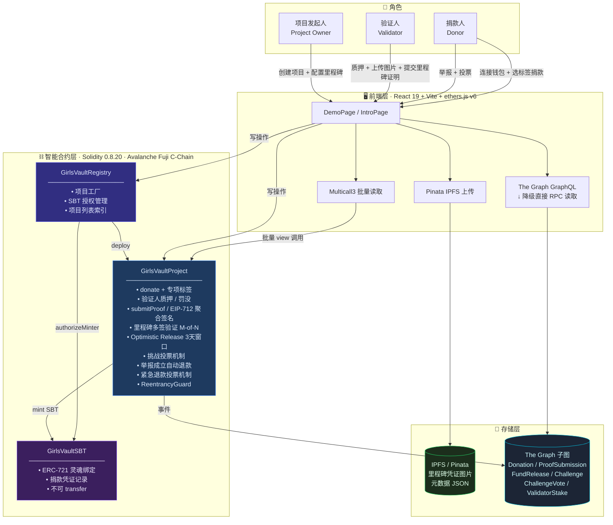

# GirlsVault

> 让每一笔善款都看得见

---

## 这个项目是怎么来的

传统公益捐款存在一个根本问题：资金流向不透明。捐款人不知道钱去了哪里，受益方拿到多少全靠机构自报，中间管理费层层抽取，真正到受益人手里的比例难以核实。

GirlsVault 用智能合约解决这个问题：资金锁在合约里，不经过任何机构账户，只有里程碑被验证人确认后才会自动释放到受益方地址，每一笔转账都在链上公开可查。

---

## 它是怎么运作的

一个公益项目的完整生命周期是这样的：

**发起**：项目方通过注册合约创建一个新的项目合约，设定募集目标、受益方地址、验证人名单，以及需要几位验证人签名才能释放资金（M-of-N 多签）。同时设定验证人质押金额——验证人必须先质押才能提交证明，作为诚信保证。

**捐款**：捐款人连接钱包，选择专项用途（教育 / 餐食 / 医疗 / 物资 / 交通），发起链上转账。资金直接进入项目合约锁仓，同时自动为捐款人铸造一枚 SBT 公益徽章作为永久凭证。

**执行与验证**：项目在地面推进过程中，本地志愿者（验证人）在每个里程碑完成后提交证明——上传照片和文字说明，内容存到 IPFS，把 CID 哈希写入合约。当足够数量的验证人完成签名，里程碑进入「已验证」状态，进入 3 天争议窗口。

**争议窗口与挑战机制**：里程碑验证后有 3 天窗口，捐款人若认为验证造假，可以提交反证并缴纳保证金发起挑战，社区捐款人按捐款额加权投票。7 天投票期结束后结算：
- 挑战成立 → 验证人质押 100% 没收，全部奖励给举报人；所有捐款人自动收到退款；项目关闭
- 挑战不成立 → 举报人保证金没收进保障池；里程碑正常进入可释放状态

**资金释放**：无挑战且 3 天窗口结束后，任何人可调用 `releaseMilestone()` 将资金释放给受益方。所有里程碑完成时，保障池余额（失败举报的保证金积累）一并转给受益方。

**异常保护**：如果项目超过 180 天没有任何里程碑推进，捐款人可以发起紧急退款投票。当投票额超过总捐款的 50%，合约允许捐款人手动领取退款。

---

## 为什么选择上链

很多事情可以用传统方式做，但有些问题只有区块链能真正解决：

| 传统公益的痛点 | GirlsVault 的解法 |
|---|---|
| 资金流向全靠机构自报 | 所有交易链上永久可查，第三方可独立验证 |
| 项目执行没有强制约束 | 资金锁在合约，不验证里程碑就不释放 |
| 中间机构抽取管理费 | 智能合约点对点执行，捐款人到受益方零中间损耗 |
| 验证人可能造假 | 质押机制 + 社区举报投票，造假代价是全部质押被没收 |
| 项目方跑路风险 | 180 天无活动触发退款投票；举报成立时自动退款 |
| 发起人信誉无法核实 | 历史完成率全从链上计算，不可伪造 |
| 捐款凭证可被伪造 | SBT 灵魂绑定 NFT，绑定捐款人地址，不可转让 |

---

## 核心功能

### 里程碑式资金释放（Optimistic Release）
项目发起时设定若干里程碑和对应的资金释放比例（以 basis points 计，100 = 1%）。每个里程碑在 M-of-N 验证人提交证明后进入「已验证」状态，等待 3 天争议窗口自然结束后，任何人可调用 `releaseMilestone()` 释放资金给受益方。

### 验证人质押机制（Validator Staking）
验证人在提交任何证明前必须先质押指定金额（Fuji 上 0.00001 AVAX，本地测试 1 ETH）。质押金额作为诚信保证金：
- 举报成立 → 质押 100% 没收，全额奖励给举报人
- 项目正常完成 → 验证人可调用 `withdrawStake()` 取回质押

### 里程碑挑战机制（Challenge & Vote）
捐款人在 3 天争议窗口内可对已验证里程碑提出挑战：
1. 缴纳保证金 + 上传反证 CID → `challengeMilestone()`
2. 其他捐款人按捐款额加权投票（举报人自己不可投票）→ `voteOnChallenge()`
3. 7 天投票期结束 → `resolveChallenge()` 结算
   - 成立：验证人质押 100% 给举报人；所有捐款人**自动收到退款**；项目关闭
   - 不成立：举报保证金没收；里程碑保持可释放状态

### EIP-712 聚合签名（链下多签）
验证人可以在链下对里程碑证明进行 EIP-712 结构化签名，任何人将签名聚合后一笔交易提交上链即可完成多签验证。原来 N 个验证人需要 N 笔交易，现在只需 1 笔，节省 gas 的同时降低操作门槛。

### 专项捐款标签
捐款时可指定用途标签：📚 教育 / 🍱 餐食 / 🏥 医疗 / 📦 物资 / 🚌 交通。各专项余额独立记录在 `tagBalances` mapping 中，确保专款专用。

### SBT 公益徽章（Soulbound Token）
每笔捐款触发一次 SBT mint，记录捐款金额、项目地址、专项标签和时间戳。SBT 是不可转让的 ERC-721 变体——合约里 `transferFrom` 和 `safeTransferFrom` 直接 revert，永久绑定在捐款人地址上。

### IPFS 凭证存储
验证人上传的图片和文字说明通过 Pinata 存入 IPFS，内容哈希（CID）写入合约。内容寻址意味着只要 CID 一致，任何人可以从任意 IPFS 节点取到原始文件，内容无法被篡改或替换。

### 自动退款（举报成立时）
举报成立时合约自动遍历所有捐款人地址，按各自捐款比例直接打回钱包，无需捐款人手动操作。转账失败时（如合约地址拒收）保留 `donorBalance` 供手动领取。

### 紧急退款保护（180天无活动）
`lastActivityAt` 记录最近一次里程碑活动时间。超过 180 天无活动，捐款人可以调用 `voteEmergencyRefund()`。当累计投票金额超过总捐款 50%，捐款人可按比例手动领取退款。退款金额 = 个人捐款 × (总捐款 - 已释放) / 总捐款，无论领取顺序早晚结果相同。

### 发起人信誉系统
前端实时聚合链上数据，计算每个发起人地址的历史项目完成率：完成项目数 / (完成 + 被退款)。好评率 ≥ 80% 显示三星，≥ 50% 两星，否则一星，新发起人显示"新发起人"。数据来源是合约状态，不可伪造。

### 首页链上统计
首页展示全局实时数据：救助项目数、爱心捐款笔数（SBT totalSupply）、链上总募集金额，数据直接来自合约，无后端服务。

### The Graph 数据索引
在 Avalanche Fuji 测试网上部署子图，用 GraphQL 查询捐款、证明、举报、投票、质押等历史记录，无需扫描区块。本地开发环境自动降级为直接 RPC 读取。

---

## 技术栈

### 智能合约

| 组件 | 技术 | 说明 |
|---|---|---|
| 合约语言 | Solidity 0.8.20 | 使用 custom errors 替代 require 字符串，节省 gas |
| 开发框架 | Hardhat 2.x | 本地节点、测试、脚本一体化 |
| 安全模式 | ReentrancyGuard（内联）| 保护所有涉及 ETH 转账的函数 |
| 多签验证 | EIP-712 结构化签名 | 链下签名聚合，链上 `ecrecover` 验证 |
| 代币标准 | ERC-721 变体（SBT）| 禁止 transfer，永久绑定捐款凭证 |
| 合约大小 | optimizer runs: 200 | 启用 Solidity 优化器保持在 24KB EIP-170 限制内 |
| 部署网络 | Avalanche Fuji C-Chain | Chain ID: 43113，原生代币 AVAX |
| 本地测试网 | Hardhat localhost | Chain ID: 31337 |
| 合约架构 | Registry + Project + SBT | 三合约分离，Registry 负责工厂和权限 |

### 前端

| 组件 | 技术 | 说明 |
|---|---|---|
| 框架 | React 19 + Vite 6 | 使用 hooks，无额外状态管理库 |
| 链交互 | ethers.js v6 | BrowserProvider + JsonRpcProvider 双模式 |
| 批量读取 | Multicall3 | 2 轮聚合替代 N×7 + N×M 次 RPC，自动降级 |
| 钱包支持 | MetaMask / Core Wallet | `window.avalanche` 优先，fallback `window.ethereum` |
| IPFS 存储 | Pinata API | 验证人凭证图片 + 元数据 JSON 上传 |
| 数据索引 | The Graph (Fuji) | GraphQL 查询；本地降级为直接 RPC 读取 |
| 部署 | Vercel | 自动 CI/CD，环境变量管理 |

### 子图（The Graph）

| 组件 | 技术 |
|---|---|
| 语言 | AssemblyScript |
| 索引策略 | Registry 监听 `ProjectCreated`，动态创建 Project 模板监听 |
| 索引实体 | Project / Donation / ProofSubmission / FundRelease / Challenge / ChallengeVote / ValidatorStake |
| 监听事件 | Donated / ProofSubmitted / MilestoneVerified / FundsReleased / MilestoneChallenged / ChallengeVoted / ChallengeResolved / ValidatorStaked / ValidatorSlashed / EmergencyRefundApproved |
| 网络 | Avalanche Fuji (`avalanche-fuji`) |

### 合约结构

```
contracts/
├── GirlsVaultRegistry.sol   # 注册中心：部署项目合约、管理 SBT 授权、维护项目列表
├── GirlsVaultProject.sol    # 项目合约：捐款、质押、里程碑验证、挑战投票、退款
└── GirlsVaultSBT.sol        # 灵魂绑定 NFT：捐款凭证，不可转让
```

资金流向：

```
捐款人
 │
 ├─ donate(tag) ──────────────→ GirlsVaultProject（资金锁仓）
 │                                   └─ mint() ──→ GirlsVaultSBT（SBT 铸造）
 │
验证人
 ├─ stakeAsValidator() ───────→ 质押进合约（诚信保证金）
 │
 ├─ submitProof(id, hash, uri) → proofCount >= M → VERIFIED
 │   或                              └─ milestoneVerifiedAt = now（3天窗口开始）
 │  submitAggregatedProof(...)
 │
捐款人（可选）
 ├─ challengeMilestone(id, cid) → 缴纳保证金 + 上传反证
 │   └─ voteOnChallenge(id, support) → 按捐款额加权投票
 │   └─ resolveChallenge(id)
 │         ├─ 成立 → 质押没收 → 自动退款给所有捐款人
 │         └─ 不成立 → 保证金进保障池 → 里程碑可释放
 │
任意人
 └─ releaseMilestone(id) ────→ 3天窗口结束后释放资金给受益方
                                └─ 最后里程碑 → 保障池余额一并给受益方

180天无活动
 └─ voteEmergencyRefund() ──→ 投票额 > 50% → claimEmergencyRefund() → 按比例退款
```

---

## 本地运行

### 环境要求

- Node.js >= 18
- MetaMask 或 [Core Wallet](https://core.app/)（浏览器插件）

### 安装依赖

```bash
# 根目录（合约 + 脚本）
npm install

# 前端
cd frontend-app && npm install
```

### 配置环境变量

```bash
# frontend-app/.env
VITE_RPC_URL=http://127.0.0.1:8545
VITE_PINATA_JWT=your_pinata_jwt_here   # 用于上传 IPFS 凭证，可在 pinata.cloud 申请
# VITE_GRAPH_URL=                      # Fuji 子图 Query URL（可选，不填自动降级）
```

### 启动

```bash
# 终端 1：启动 Hardhat 本地节点
npx hardhat node

# 终端 2：部署合约 + 创建 3 个演示项目 + 写入前端配置
npx hardhat run scripts/setup.js --network localhost

# 终端 3：启动前端
cd frontend-app && npm run dev
# 访问 http://localhost:5174
```

### 在 MetaMask 中添加本地网络

| 字段 | 值 |
|---|---|
| 网络名称 | Hardhat Local |
| RPC URL | http://127.0.0.1:8545 |
| Chain ID | 31337 |
| 货币符号 | ETH |

导入测试账户（Hardhat 默认账户 #0，仅用于本地测试，不要在生产环境使用）：

```
私钥: 
```

### 本地测试参数说明

本地环境与 Fuji 有以下差异：

| 参数 | 本地 | Fuji |
|---|---|---|
| 验证人质押 | 1 ETH | 0.00001 AVAX |
| 举报保证金 | 0.00001 ETH | 0.00001 AVAX |
| 项目募集目标 | 5–10 ETH | 0.001 AVAX |
| 时间快进 | 支持（`evm_increaseTime`）| 不支持 |

---

## 部署到 Fuji 测试网

### 合约部署

在根目录创建 `.env`：

```bash
FUJI_RPC_URL=https://api.avax-test.network/ext/bc/C/rpc
PRIVATE_KEY=your_wallet_private_key

# 可选：指定验证人和受益方（不填则使用部署账户，仅适合演示）
VALIDATOR_1=0x...
VALIDATOR_2=0x...
VALIDATOR_3=0x...
BENEFICIARY_1=0x...
```

部署：

```bash
npx hardhat run scripts/setup.js --network fuji
```

脚本会自动：
1. 部署 Registry 和 SBT 合约
2. 创建 3 个演示项目
3. 写入 `frontend-app/src/utils/deployed.fuji.json`
4. 更新 `subgraph/subgraph.yaml` 中的合约地址和起始区块

### 前端部署（Vercel）

在 Vercel 项目设置中添加环境变量：

```
VITE_RPC_URL    = https://api.avax-test.network/ext/bc/C/rpc
VITE_PINATA_JWT = your_pinata_jwt
VITE_GRAPH_URL  = https://api.studio.thegraph.com/query/.../girlsvault/v0.0.1
```

### The Graph 子图部署

```bash
cd subgraph

# 安装依赖、生成类型、编译
npm install
npm run codegen
npm run build

# 在 https://thegraph.com/studio/ 创建子图，名称：girlsvault
graph auth --studio <YOUR_DEPLOY_KEY>
npm run deploy
```

部署后将 Studio 提供的 Query URL 填入 Vercel 的 `VITE_GRAPH_URL`，前端会自动切换到 GraphQL 模式。

---

## 系统架构图



---

## 关于信任模型

GirlsVault 没有管理员后门，没有 `pause()` 函数，没有可升级代理。合约一旦部署，规则就固定了。这是一个刻意的设计选择——公益本来就不应该依赖"相信我们"，而应该依赖可以被任何人审计的代码。

验证人是项目发起时在构造函数里写死的地址，不可动态添加或删除。质押机制让验证人的诚信有了经济成本，社区举报投票让虚假证明可以被纠正。发起人信誉数据完全来自链上事件聚合，没有任何人可以手动修改。SBT 凭证不依赖这个前端存在，任何 NFT 浏览器或自己写的脚本都可以独立查证。

这不是说这个系统完美无缺，但它的边界是清晰的：链上的部分是可信的，链下的部分（IPFS 内容、前端 UI、验证人身份）需要额外信任。

---

## License

MIT
