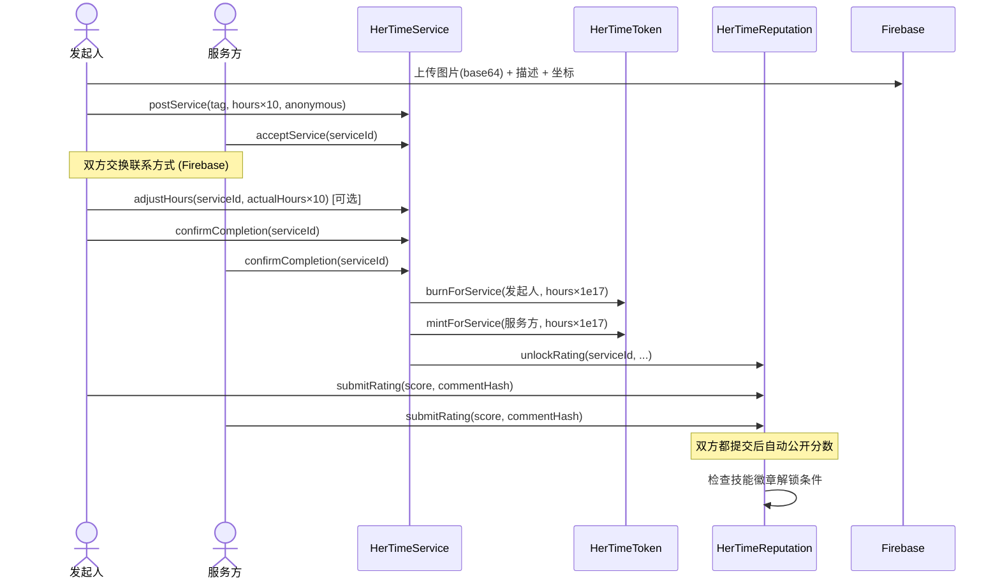
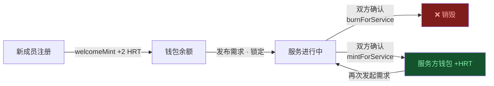

# HerTime Protocol

> 那些不被看见的付出，从此有迹可循

一个基于区块链的女性互助时间银行。将每一小时的互助服务转化为链上 Token，用不可篡改的记录和声誉体系，让女性群体内部的互助真正可信、可积累、可迁移。

---

## 目录

- [项目起源](#-项目起源)
- [主要功能](#-主要功能)
- [创新性：我们在解决什么真实问题](#-创新性我们在解决什么真实问题)
- [架构图](#-架构图)
- [技术实现](#-技术实现)
- [用户体验与交互流程](#-用户体验与交互流程)
- [本地运行](#-本地运行)
- [项目结构](#-项目结构)
- [设计决策](#-设计决策)

---

## 🌱 项目起源

2024 年，上海时间银行宣布暂停运营。这不是孤例——传统时间银行长期面临一个根本性困境：**时长存在平台，平台说停就停，用户的每一小时付出随时可能归零。**

除此之外，传统时间银行还有一个跨地域的结构性障碍：时间银行往往由各地社区、街道、机构分散管理，彼此之间的积分不互通。这对流动性强的人群尤为不友好——比如，你在上海陪护了邻居的老人，积累了若干时长，但当你希望家在成都的父母也能享受到类似的上门服务时，你在本地积累的时长完全无法兑换，因为两个城市根本不是同一套系统。

**HerTime 由此而来。** 我们希望用区块链解决这个问题的根源：让时长真正属于用户，跨越平台、跨越地域，永久保存，自由流通。同时，我们聚焦女性群体——无论是职场困惑、育儿压力、就医陪伴还是情感支持，这些真实的互助需求长期存在，却缺乏一个可信、安全、可积累的承载体系。

---

## ✨ 主要功能

### 需求广场
- 浏览社区内其他成员发布的互助需求，支持按距离筛选（5km / 10km / 20km）
- 每张需求卡片展示图片缩略图、服务类型、发布人信誉评分
- 点击查看详情：完整描述、现场图片、服务地点地图、接单人技能徽章与信誉分
- 接单后双方通过加密渠道交换联系方式

### 发布需求
- 选择服务类型（生活支持 / 情感支持 / 技能分享 / 知识教学 / 创意协作）
- 设置预计时长，精确到 0.1 小时（如 0.5h、1.3h）
- 上传现场图片（浏览器压缩后存储，无需付费云服务）
- 支持地址搜索定位，选择见面地点
- 可选匿名发布，保护隐私

### 服务完成与结算
- 发起人可在确认前调整实际服务时长（协商机制）
- 双方各自链上确认，发起人须先确认（合约层防止恶意缩短时长）
- 确认完成后自动触发链上 HRT Token 流转：发起人 burn，服务方 mint
- 完成后双方互评，双盲机制保证评分公正

### 我的主页
- 查看 HRT 余额、服务均分、技能徽章解锁进度
- HRT 贡献轨迹折线图（支持日 / 月 / 年切换）
- 历史服务记录（含图片灯箱、地图、联系方式）

### 社区排行榜
- 本周 / 全年 HRT 贡献排名
- 每位成员展示技能徽章
- 顶部固定显示"我的排名"

### 附近成员地图
- 实时展示附近成员位置（坐标截断至 ±1km 保护隐私）
- 点击成员查看基本信息与服务记录

---

## 💡 创新性：我们在解决什么真实问题

### Web2 时间银行的结构性缺陷

| 痛点 | 根因 |
|------|------|
| 平台停运，积分清零 | Token 存在平台数据库，不归用户所有 |
| 贡献记录可被修改 | 平台对数据有完全控制权 |
| 跨社群积累无法迁移 | 数据孤岛，换平台等于从零开始 |
| 接单无法验证对方信誉 | 没有可信的链上口碑系统 |

### HerTime 的解法

**不是把时间银行搬上链，而是用区块链重新设计信任机制：**

1. **Token 主权归用户**：HRT 存在自己的钱包，平台无法冻结或清零，平台停运也不影响用户资产
2. **跨地域互通**：基于公链，任何地方的服务都积累在同一个钱包地址，彻底打通地域壁垒
3. **声誉不可篡改**：双盲评分上链，双方都提交后才同时公开，防报复性打分
4. **技能证明永久存在**：Soulbound NFT 基于真实链上服务记录自动颁发，不可转让，不随平台消亡
5. **0.1 小时精度结算**：合约支持 0.5h、0.3h 等非整数时长，贴合真实互助场景
6. **结单时长可协商**：发起人在确认前可调整实际时长并同步链上（发起人先确认机制防止恶意缩短）

---

## 🏗 架构图

### 系统整体架构

```mermaid
graph TB
    subgraph 用户层
        U[用户 · MetaMask 钱包]
    end

    subgraph 前端 React + Vite
        A[IntroPage 项目介绍]
        B[BoardTab 需求广场]
        C[PostTab 发布需求]
        D[ProfileTab 我的主页]
        E[LeaderboardTab 排行榜]
        F[MapPage 附近成员地图]
    end

    subgraph 智能合约层 Avalanche Fuji / Hardhat
        SC1[HerTimeService\n发布·接单·确认·协商时长]
        SC2[HerTimeToken ERC20\n1 HRT = 1h · 0.1h 精度]
        SC3[HerTimeReputation\n双盲评分·均分统计]
        SC4[HerTimeSkillNFT ERC721\nSoulbound 技能徽章]
    end

    subgraph 链下存储 Firebase Realtime DB
        F1[service_details\n描述·期望时间]
        F2[service_images\nCanvas base64 图片]
        F3[service_locations\n见面地点坐标]
        F4[locations\n成员实时位置]
        F5[contacts\n双方联系方式]
        F6[actual_hours\n协商时长备注]
    end

    U -->|连接钱包| 前端 React + Vite
    前端 React + Vite -->|ethers.js v6| 智能合约层 Avalanche Fuji / Hardhat
    前端 React + Vite -->|读写| 链下存储 Firebase Realtime DB
    SC1 -->|mint/burn| SC2
    SC1 -->|unlockRating| SC3
    SC3 -->|颁发 NFT| SC4
```

### 服务完整生命周期



### Token 流转机制



---

## ⚙️ 技术实现

### 核心功能

#### HRT Token 精度结算（0.1 小时粒度）

Solidity 不支持浮点数，HerTime 采用"×10 整数"方案：链上以 `uint256` 存储 **tenth-hours**（0.5h → 5，1.3h → 13），Token mint/burn 时乘以 `1e17`，从而在 18 位精度的 ERC20 框架下实现 0.1 HRT 的最小单位。

```solidity
// HerTimeToken.sol
function mintForService(address _provider, uint256 _tenthHours, bytes32 _serviceId)
    external onlyRole(MINTER_ROLE) {
    uint256 amount = _tenthHours * 1e17;   // 5 → 0.5 HRT
    _mint(_provider, amount);
}
```

发起 0.5h 服务 = 需求方 burn 0.5 HRT，服务方 mint 0.5 HRT，链上精确对应，无舍入误差。

---

#### 服务时长协商机制（adjustHours）

服务完成后双方可能对实际时长有异议，`adjustHours` 允许发起人在自己确认前修改链上时长：

```solidity
// HerTimeService.sol
function adjustHours(bytes32 _id, uint256 _newHours) external {
    Service storage s = services[_id];
    require(s.status == ServiceStatus.MATCHED, "Service not matched");
    require(msg.sender == s.actualRequester, "Only requester can adjust");
    require(!s.requesterConfirmed, "Requester has already confirmed");
    s.numHours = _newHours;
}
```

**发起人强制先确认**：`confirmCompletion` 中，服务方确认时强制 `require(s.requesterConfirmed)`，从合约层根除"服务方先确认后发起人恶意缩短时长"的攻击路径。

---

#### 匿名发布（链上隐私隔离）

发布需求时可选匿名，合约内部用两个字段分离展示身份与实际身份：

```solidity
address requester;       // 对外：匿名时为 address(0)
address actualRequester; // 内部：用于 burn 和操作权限验证
```

匿名服务完成后，`unlockRating` 传入的是展示地址（`address(0)`），保护发起人身份不被评分记录关联。

---

#### 双盲评分系统（Commit-Reveal）

双方各自先提交 `keccak256(comment)` + score，两者都上链后同时公开，防止一方看到对方分数后再决定如何打分：

- `submitRating(serviceId, score, commentHash)` — 提交阶段
- 合约检测 `bothSubmitted` 后自动触发 `RatingRevealed` 事件，同时更新均分并检查技能徽章解锁条件
- 均分以 `×100` 整数存储（492 = 4.92 分），避免浮点风险

---

#### Soulbound NFT 技能徽章（ERC721 不可转让）

`HerTimeSkillNFT` 继承 ERC721，将 `transferFrom` 和 `safeTransferFrom` 直接 override 为 `revert`，真正锁死流通性。由 `HerTimeReputation` 合约根据链上服务次数与均分自动颁发，无需管理员手动操作（危机支持者徽章除外）：

| 徽章 | 解锁条件 |
|------|----------|
| 👂 倾听者 | 情感支持 ≥5 次，均分 ≥4.50 |
| 🏥 就医陪伴 | 生活支持 ≥3 次 |
| 👶 育儿伙伴 | 生活支持 ≥5 次，均分 ≥4.00 |
| 📚 技能导师 | 技能技术 ≥8 次，均分 ≥4.50 |
| 🛡️ 社区守护者 | 累计完成 ≥50 次服务 |
| 🆘 危机支持者 | 管理员颁发 |

---

#### 免费图片存储（Canvas API + Firebase Realtime DB）

Firebase Storage 需要付费套餐（Blaze Plan）。HerTime 改用**浏览器 Canvas API** 将图片压缩至 600px JPEG base64（约 30–50KB），写入免费的 Firebase Realtime Database，完全零成本实现图片上传与展示功能。

---

#### 链下数据分层存储

链上只存结算关键数据（时长、tag、地址、状态），以下数据存 Firebase，降低 gas 成本同时保护隐私：

| Firebase 节点 | 内容 | 访问权限 |
|--------------|------|---------|
| `service_details` | 描述文字、期望时间 | 公开读 |
| `service_images` | Canvas base64 图片 | 公开读 |
| `service_locations` | 见面地点坐标 | 公开读 |
| `locations` | 成员实时位置（截断至 ±1km） | 公开读 |
| `contacts` | 双方联系方式 | 仅当事人可见 |
| `actual_hours` | 协商时长备注 | 仅当事人可见 |

---

#### HRT 贡献轨迹（链上事件历史）

个人主页的折线图直接查询链上 `ServiceMint` 和 `ServiceBurn` 事件，通过 ethers.js v6 的 `queryFilter` 聚合历史数据，按日/月/年分组展示贡献趋势，无需后端数据库：

```js
const mintEvents = await token.queryFilter(token.filters.ServiceMint(address))
const burnEvents = await token.queryFilter(token.filters.ServiceBurn(address))
```

---

### 技术栈总览

| 层级 | 技术 | 用途 |
|------|------|------|
| 合约语言 | Solidity ^0.8.24 | 核心业务逻辑 |
| 合约框架 | Hardhat | 编译、本地节点、脚本部署 |
| 合约库 | OpenZeppelin | ERC20 / ERC721 / AccessControl |
| 网络 | Avalanche Fuji C-Chain (43113) | 测试网部署 |
| 前端框架 | React 18 + Vite | UI 构建与热更新 |
| 钱包交互 | ethers.js v6 | 钱包连接、合约调用、事件查询（queryFilter） |
| 数据可视化 | recharts AreaChart | HRT 贡献轨迹折线图（日/月/年） |
| 地图 | react-leaflet + Leaflet | 附近成员地图、服务地点定位 |
| 地址搜索 | Nominatim (OpenStreetMap) | 发布需求时关键词搜索地址坐标 |
| 链下数据库 | Firebase Realtime Database | 图片、描述、联系方式、位置（免费套餐） |
| 图片处理 | 浏览器 Canvas API | 图片压缩为 base64 JPEG，替代付费云存储 |
| 隐私保护 | 坐标截断 + address(0) 隔离 | 位置模糊化 + 匿名身份保护 |

---

## 🎯 用户体验与交互流程

### 主要用户旅程

```
注册（+2 HRT）
  │
  ├─▶ 发布需求
  │     ├─ 选择类型 / 设置时长（0.1h 精度）/ 写描述 / 上传图片 / 选地点
  │     └─ 发布成功弹窗 → 跳转广场
  │
  ├─▶ 需求广场浏览
  │     ├─ 按距离筛选（全部 / 5km / 10km / 20km）
  │     ├─ 卡片显示：图片缩略图 / 发布人信誉分 / "我发布的"标记
  │     └─ 详情弹窗：描述 / 图片 / 地图 / 接单人徽章+评分 / 联系方式交换
  │
  ├─▶ 服务完成流程
  │     ├─ 发起人：确认结单（可调整实际时长，支持手动输入 0.1h 精度）
  │     ├─ 服务方：确认完成
  │     └─ 链上自动结算 HRT
  │
  ├─▶ 我的主页
  │     ├─ HRT 余额 / 均分 / 技能徽章进度
  │     ├─ HRT 贡献轨迹折线图（日/月/年切换）
  │     └─ 服务记录详情（图片灯箱 / 地图 / 联系方式 / 操作按钮）
  │
  └─▶ 排行榜
        ├─ 本周 / 全年 HRT 贡献排名
        ├─ 我的排名卡（顶部固定展示）
        └─ 各用户技能徽章展示
```

### 隐私保护设计

| 场景 | 保护方式 |
|------|----------|
| 位置上报 | 坐标截断到小数点后 2 位（约 ±1km 误差） |
| 匿名发布 | 链上存 `address(0)`，实际地址在合约内部隔离 |
| 联系方式 | 仅存 Firebase，仅双方当事人可见 |
| 评分内容 | 双盲机制，双方都提交后才同时公开 |

---

## 🚀 本地运行

```bash
# 1. 安装合约依赖
npm install

# 2. 启动本地节点
npx hardhat node

# 3. 部署合约（新终端）
npx hardhat run scripts/deploy.js --network localhost
# → 自动写入 frontend/src/utils/deployed.localhost.json

# 4. 启动前端
cd frontend && npm install && npm run dev
```

**MetaMask 配置：**
- RPC：`http://127.0.0.1:8545`，chainId `31337`
- 测试账户私钥：运行 `npx hardhat node` 后终端会打印所有测试账户地址和私钥，复制任意一个导入 MetaMask 即可

**部署到 Fuji 测试网：**
```bash
# 创建 .env
PRIVATE_KEY=你的私钥
FUJI_RPC_URL=https://api.avax-test.network/ext/bc/C/rpc

npx hardhat run scripts/deploy.js --network fuji
```

---

## 📁 项目结构

```
hertime/
├── contracts/
│   ├── HerTimeToken.sol        # ERC20，0.1h 精度（×10 单位 + ×1e17 mint）
│   ├── HerTimeService.sol      # 服务全生命周期 + adjustHours 协商机制
│   ├── HerTimeReputation.sol   # 双盲评分
│   └── HerTimeSkillNFT.sol     # Soulbound NFT，transfer 被锁死
├── scripts/
│   └── deploy.js               # 部署 + 角色配置 + 地址写入前端
├── frontend/src/
│   ├── pages/
│   │   ├── DemoPage.jsx        # 主应用（四个 Tab + 所有弹窗逻辑）
│   │   ├── IntroPage.jsx       # 项目介绍落地页
│   │   └── MapPage.jsx         # 全屏附近成员地图
│   └── utils/
│       ├── contracts.js        # ABI + 多网络地址加载（自动按 chainId 切换）
│       ├── firebase.js         # 链下读写封装（位置/图片/联系方式/时长备注）
│       ├── deployed.localhost.json
│       └── deployed.fuji.json
└── hardhat.config.js
```

---

## 🔑 设计决策速查

| 决策 | 原因 |
|------|------|
| 时长用 ×10 整数存储 | Solidity 无浮点，`tenthHours × 1e17` 在 18 位精度下无损表达 0.1h |
| 图片存 Firebase Realtime DB 而非 Storage | Storage 需付费 Blaze Plan，Canvas base64 压缩后约 30-50KB，免费套餐完全够用 |
| 强制发起人先确认 | 防止发起人在服务方确认后恶意通过 `adjustHours` 缩短时长，合约层根除此攻击路径 |
| 坐标截断至小数点后 2 位 | 约 ±1km 误差，能用于距离筛选，同时无法精确定位到用户住所 |
| 联系方式存 Firebase 不上链 | 降低 gas 成本，且链上数据永久公开，手机号/微信不应上链 |
| 评分用 `×100` 整数存储 | 避免均分计算引入浮点误差，492 = 4.92 分，前端 ÷100 展示 |
